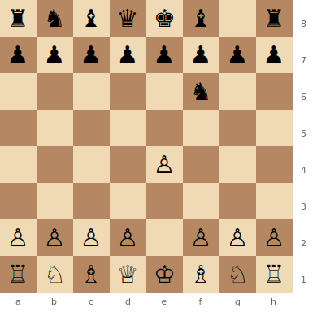
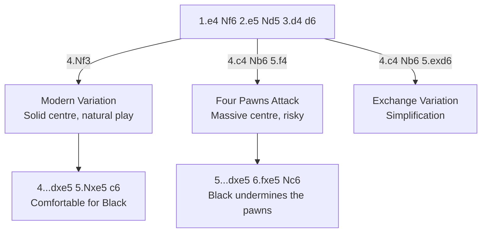

# Alekhine's Defense

**1.e4 Nf6**

A provocative, hypermodern opening. Black invites White to push the e-pawn forward, then plans to undermine the overextended centre. Named after World Champion Alexander Alekhine.

**Position after 1.e4 Nf6 (Alekhine's Defense)**



> **FEN:** `rnbqkb1r/pppppppp/5n2/8/4P3/8/PPPP1PPP/RNBQKBNR w - - 0 1`

**See also:** [Pirc & Modern](pirc-modern.md) | [Scandinavian](scandinavian.md) | [Fundamentals — Centre Control](../../fundamentals/centre-control.md)

### Variation Tree



---

## Modern Variation (4.Nf3)

```
1.e4 Nf6 2.e5 Nd5 3.d4 d6 4.Nf3 dxe5 5.Nxe5 c6
```

The most common approach. White maintains a solid centre and develops naturally. Black aims for ...Bf5 or ...Bg4 and ...e6 with a comfortable position.

## Four Pawns Attack (4.c4 Nb6 5.f4)

```
1.e4 Nf6 2.e5 Nd5 3.d4 d6 4.c4 Nb6 5.f4 dxe5 6.fxe5 Nc6 7.Be3 Bf5
```

White builds a massive pawn centre (c4, d4, e5, f4). Impressive but potentially overextended — Black aims to crack it with ...c5, ...f6, or ...e6.

### Strategic Ideas

| White | Black |
|-------|-------|
| Push the e-pawn forward, gaining space | Provoke the pawns forward, then undermine them |
| Four Pawns Attack: maximum aggression | The knight retreats are part of the plan |
| Maintain the centre | ...c5, ...f6, or ...e6 to break through |

## Exchange Variation (4.c4 Nb6 5.exd6)

```
5.exd6 exd6 (or cxd6)
```

White simplifies. After ...exd6, Black has a slightly passive but solid position with the bishop pair.

---

## Famous Practitioners

Alexander Alekhine (inventor), Bobby Fischer (occasional use), Lev Alburt.

## Who Should Play It

Players who enjoy provocative, counterattacking play. Must be comfortable with cramped positions that eventually open up.

---

**Next:** [Scandinavian Defense](scandinavian.md) | **Back to:** [Openings Index](../index.md)
