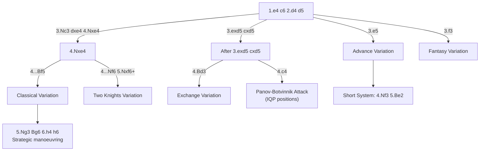

# Caro-Kann Defense

**1.e4 c6**

Solid and reliable. Black prepares ...d5 to challenge White's centre while keeping the light-squared bishop unblocked (unlike the [French](french-defense.md)). The trade-off is that ...c6 is slower than ...e5 or ...c5.

**Position after 1.e4 c6 2.d4 d5 (Caro-Kann Defense)**

<svg viewBox="0 0 390 400" xmlns="http://www.w3.org/2000/svg" style="max-width:400px">
  <rect x="0" y="0" width="360" height="360" fill="#b58863"/>
  <rect x="0" y="0" width="45" height="45" fill="#f0d9b5"/><rect x="90" y="0" width="45" height="45" fill="#f0d9b5"/><rect x="180" y="0" width="45" height="45" fill="#f0d9b5"/><rect x="270" y="0" width="45" height="45" fill="#f0d9b5"/>
  <rect x="45" y="45" width="45" height="45" fill="#f0d9b5"/><rect x="135" y="45" width="45" height="45" fill="#f0d9b5"/><rect x="225" y="45" width="45" height="45" fill="#f0d9b5"/><rect x="315" y="45" width="45" height="45" fill="#f0d9b5"/>
  <rect x="0" y="90" width="45" height="45" fill="#f0d9b5"/><rect x="90" y="90" width="45" height="45" fill="#f0d9b5"/><rect x="180" y="90" width="45" height="45" fill="#f0d9b5"/><rect x="270" y="90" width="45" height="45" fill="#f0d9b5"/>
  <rect x="45" y="135" width="45" height="45" fill="#f0d9b5"/><rect x="135" y="135" width="45" height="45" fill="#f0d9b5"/><rect x="225" y="135" width="45" height="45" fill="#f0d9b5"/><rect x="315" y="135" width="45" height="45" fill="#f0d9b5"/>
  <rect x="0" y="180" width="45" height="45" fill="#f0d9b5"/><rect x="90" y="180" width="45" height="45" fill="#f0d9b5"/><rect x="180" y="180" width="45" height="45" fill="#f0d9b5"/><rect x="270" y="180" width="45" height="45" fill="#f0d9b5"/>
  <rect x="45" y="225" width="45" height="45" fill="#f0d9b5"/><rect x="135" y="225" width="45" height="45" fill="#f0d9b5"/><rect x="225" y="225" width="45" height="45" fill="#f0d9b5"/><rect x="315" y="225" width="45" height="45" fill="#f0d9b5"/>
  <rect x="0" y="270" width="45" height="45" fill="#f0d9b5"/><rect x="90" y="270" width="45" height="45" fill="#f0d9b5"/><rect x="180" y="270" width="45" height="45" fill="#f0d9b5"/><rect x="270" y="270" width="45" height="45" fill="#f0d9b5"/>
  <rect x="45" y="315" width="45" height="45" fill="#f0d9b5"/><rect x="135" y="315" width="45" height="45" fill="#f0d9b5"/><rect x="225" y="315" width="45" height="45" fill="#f0d9b5"/><rect x="315" y="315" width="45" height="45" fill="#f0d9b5"/>
  <!-- Pieces -->
  <text x="22" y="33" font-size="30" text-anchor="middle" font-family="sans-serif">♜</text>
  <text x="67" y="33" font-size="30" text-anchor="middle" font-family="sans-serif">♞</text>
  <text x="112" y="33" font-size="30" text-anchor="middle" font-family="sans-serif">♝</text>
  <text x="157" y="33" font-size="30" text-anchor="middle" font-family="sans-serif">♛</text>
  <text x="202" y="33" font-size="30" text-anchor="middle" font-family="sans-serif">♚</text>
  <text x="247" y="33" font-size="30" text-anchor="middle" font-family="sans-serif">♝</text>
  <text x="292" y="33" font-size="30" text-anchor="middle" font-family="sans-serif">♞</text>
  <text x="337" y="33" font-size="30" text-anchor="middle" font-family="sans-serif">♜</text>
  <text x="22" y="78" font-size="30" text-anchor="middle" font-family="sans-serif">♟</text>
  <text x="67" y="78" font-size="30" text-anchor="middle" font-family="sans-serif">♟</text>
  <text x="202" y="78" font-size="30" text-anchor="middle" font-family="sans-serif">♟</text>
  <text x="247" y="78" font-size="30" text-anchor="middle" font-family="sans-serif">♟</text>
  <text x="292" y="78" font-size="30" text-anchor="middle" font-family="sans-serif">♟</text>
  <text x="337" y="78" font-size="30" text-anchor="middle" font-family="sans-serif">♟</text>
  <text x="112" y="123" font-size="30" text-anchor="middle" font-family="sans-serif">♟</text>
  <text x="157" y="168" font-size="30" text-anchor="middle" font-family="sans-serif">♟</text>
  <text x="157" y="213" font-size="30" text-anchor="middle" font-family="sans-serif">♙</text>
  <text x="202" y="213" font-size="30" text-anchor="middle" font-family="sans-serif">♙</text>
  <text x="22" y="303" font-size="30" text-anchor="middle" font-family="sans-serif">♙</text>
  <text x="67" y="303" font-size="30" text-anchor="middle" font-family="sans-serif">♙</text>
  <text x="112" y="303" font-size="30" text-anchor="middle" font-family="sans-serif">♙</text>
  <text x="247" y="303" font-size="30" text-anchor="middle" font-family="sans-serif">♙</text>
  <text x="292" y="303" font-size="30" text-anchor="middle" font-family="sans-serif">♙</text>
  <text x="337" y="303" font-size="30" text-anchor="middle" font-family="sans-serif">♙</text>
  <text x="22" y="348" font-size="30" text-anchor="middle" font-family="sans-serif">♖</text>
  <text x="67" y="348" font-size="30" text-anchor="middle" font-family="sans-serif">♘</text>
  <text x="112" y="348" font-size="30" text-anchor="middle" font-family="sans-serif">♗</text>
  <text x="157" y="348" font-size="30" text-anchor="middle" font-family="sans-serif">♕</text>
  <text x="202" y="348" font-size="30" text-anchor="middle" font-family="sans-serif">♔</text>
  <text x="247" y="348" font-size="30" text-anchor="middle" font-family="sans-serif">♗</text>
  <text x="292" y="348" font-size="30" text-anchor="middle" font-family="sans-serif">♘</text>
  <text x="337" y="348" font-size="30" text-anchor="middle" font-family="sans-serif">♖</text>
  <!-- Coordinates -->
  <text x="22" y="375" font-size="11" fill="#666" text-anchor="middle" font-family="sans-serif">a</text>
  <text x="67" y="375" font-size="11" fill="#666" text-anchor="middle" font-family="sans-serif">b</text>
  <text x="112" y="375" font-size="11" fill="#666" text-anchor="middle" font-family="sans-serif">c</text>
  <text x="157" y="375" font-size="11" fill="#666" text-anchor="middle" font-family="sans-serif">d</text>
  <text x="202" y="375" font-size="11" fill="#666" text-anchor="middle" font-family="sans-serif">e</text>
  <text x="247" y="375" font-size="11" fill="#666" text-anchor="middle" font-family="sans-serif">f</text>
  <text x="292" y="375" font-size="11" fill="#666" text-anchor="middle" font-family="sans-serif">g</text>
  <text x="337" y="375" font-size="11" fill="#666" text-anchor="middle" font-family="sans-serif">h</text>
  <text x="370" y="33" font-size="11" fill="#666" font-family="sans-serif">8</text>
  <text x="370" y="78" font-size="11" fill="#666" font-family="sans-serif">7</text>
  <text x="370" y="123" font-size="11" fill="#666" font-family="sans-serif">6</text>
  <text x="370" y="168" font-size="11" fill="#666" font-family="sans-serif">5</text>
  <text x="370" y="213" font-size="11" fill="#666" font-family="sans-serif">4</text>
  <text x="370" y="258" font-size="11" fill="#666" font-family="sans-serif">3</text>
  <text x="370" y="303" font-size="11" fill="#666" font-family="sans-serif">2</text>
  <text x="370" y="348" font-size="11" fill="#666" font-family="sans-serif">1</text>
</svg>

> **FEN:** `rnbqkbnr/pp2pppp/2p5/3p4/3PP3/8/PPP2PPP/RNBQKBNR w - - 0 1`

**See also:** [French Defense](french-defense.md) | [Scandinavian](scandinavian.md) | [Middlegame — Pawn Structures](../../middlegame/pawn-structures.md)

### Variation Tree



---

## Classical Variation (4...Bf5)

```
1.e4 c6 2.d4 d5 3.Nc3 dxe4 4.Nxe4 Bf5
5.Ng3 Bg6 6.h4 h6 7.Nf3 Nd7 8.h5 Bh7 9.Bd3 Bxd3 10.Qxd3 e6 11.Bf4 Ngf6 12.O-O-O Be7
```

### Strategic Ideas

| White | Black |
|-------|-------|
| h4–h5 gains kingside space, displaces Black's bishop | Solid development: ...Nd7, ...Ngf6, ...e6, ...Be7 |
| Castle queenside; central or kingside initiative | Aim for ...c5 to challenge the centre |
| The bishop exchange (Bxd3) eliminates White's good bishop | Rock-solid and hard to break down |

### Famous Practitioners

Anatoly Karpov (lifetime Caro-Kann devotee), Viswanathan Anand, Ding Liren.

---

## Advance Variation (3.e5)

```
1.e4 c6 2.d4 d5 3.e5 Bf5 4.Nf3 e6 5.Be2 Nd7 6.O-O Ne7
```

Similar to the [French Advance](french-defense.md) but Black's light-squared bishop is **already outside the chain** — a significant advantage over the French.

### The Short System (4.Nf3, 5.Be2)

Nigel Short popularised this quiet but effective approach. White plays solidly and aims to exploit the space advantage.

---

## Exchange Variation (3.exd5 cxd5)

```
1.e4 c6 2.d4 d5 3.exd5 cxd5 4.Bd3 Nc6 5.c3 Nf6 6.Bf4 Bg4
```

Often used as a "draw offer" variation. Both sides have symmetric development with straightforward plans. Can be played ambitiously with a minority attack (b4–b5).

---

## Panov-Botvinnik Attack (4.c4)

```
1.e4 c6 2.d4 d5 3.exd5 cxd5 4.c4 Nf6 5.Nc3 e6 6.Nf3 Bb4 7.cxd5 Nxd5
```

Creates an **isolated queen pawn** (IQP) position. White gets active piece play and attacking chances; Black can blockade on d5 and aim for favourable endgames.

See [Middlegame — Pawn Structures (IQP)](../../middlegame/pawn-structures.md) for detailed IQP strategy.

### Famous Practitioners

Mikhail Botvinnik, Garry Kasparov.

---

## Two Knights Variation (3.Nc3 dxe4 4.Nxe4 Nf6 5.Nxf6+)

```
5.Nxf6+ exf6 (or gxf6)
```

White simplifies but damages Black's structure. After ...exf6, Black has doubled f-pawns but the open e-file and bishop pair compensate.

## Tal Variation / Fantasy Variation (3.f3)

```
1.e4 c6 2.d4 d5 3.f3
```

Aggressive — White prepares a big centre with e4 maintained. Risky but leads to non-standard positions.

---

## Who Should Play It

The Caro-Kann suits solid positional players who want reliability against 1.e4. It avoids the "bad bishop" problem of the French while maintaining a sound structure. Less dynamic than the [Sicilian](sicilian-defense.md) but harder to attack.

---

**Next:** [Pirc & Modern Defense](pirc-modern.md) | **Back to:** [Openings Index](../index.md)
