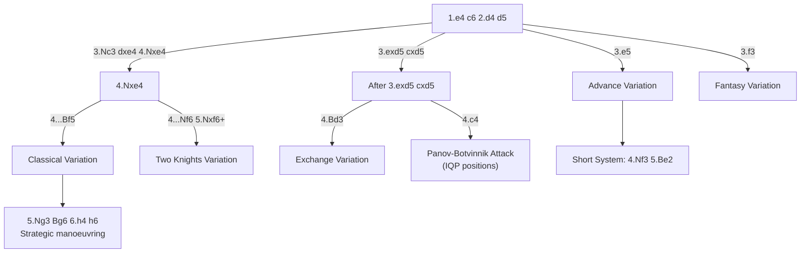

# Caro-Kann Defense

**1.e4 c6**

Solid and reliable. Black prepares ...d5 to challenge White's centre while keeping the light-squared bishop unblocked (unlike the [French](french-defense.md)). The trade-off is that ...c6 is slower than ...e5 or ...c5.

**See also:** [French Defense](french-defense.md) | [Scandinavian](scandinavian.md) | [Middlegame — Pawn Structures](../../middlegame/pawn-structures.md)

### Variation Tree



---

## Classical Variation (4...Bf5)

```
1.e4 c6 2.d4 d5 3.Nc3 dxe4 4.Nxe4 Bf5
5.Ng3 Bg6 6.h4 h6 7.Nf3 Nd7 8.h5 Bh7 9.Bd3 Bxd3 10.Qxd3 e6 11.Bf4 Ngf6 12.O-O-O Be7
```

### Strategic Ideas

| White | Black |
|-------|-------|
| h4–h5 gains kingside space, displaces Black's bishop | Solid development: ...Nd7, ...Ngf6, ...e6, ...Be7 |
| Castle queenside; central or kingside initiative | Aim for ...c5 to challenge the centre |
| The bishop exchange (Bxd3) eliminates White's good bishop | Rock-solid and hard to break down |

### Famous Practitioners

Anatoly Karpov (lifetime Caro-Kann devotee), Viswanathan Anand, Ding Liren.

---

## Advance Variation (3.e5)

```
1.e4 c6 2.d4 d5 3.e5 Bf5 4.Nf3 e6 5.Be2 Nd7 6.O-O Ne7
```

Similar to the [French Advance](french-defense.md) but Black's light-squared bishop is **already outside the chain** — a significant advantage over the French.

### The Short System (4.Nf3, 5.Be2)

Nigel Short popularised this quiet but effective approach. White plays solidly and aims to exploit the space advantage.

---

## Exchange Variation (3.exd5 cxd5)

```
1.e4 c6 2.d4 d5 3.exd5 cxd5 4.Bd3 Nc6 5.c3 Nf6 6.Bf4 Bg4
```

Often used as a "draw offer" variation. Both sides have symmetric development with straightforward plans. Can be played ambitiously with a minority attack (b4–b5).

---

## Panov-Botvinnik Attack (4.c4)

```
1.e4 c6 2.d4 d5 3.exd5 cxd5 4.c4 Nf6 5.Nc3 e6 6.Nf3 Bb4 7.cxd5 Nxd5
```

Creates an **isolated queen pawn** (IQP) position. White gets active piece play and attacking chances; Black can blockade on d5 and aim for favourable endgames.

See [Middlegame — Pawn Structures (IQP)](../../middlegame/pawn-structures.md) for detailed IQP strategy.

### Famous Practitioners

Mikhail Botvinnik, Garry Kasparov.

---

## Two Knights Variation (3.Nc3 dxe4 4.Nxe4 Nf6 5.Nxf6+)

```
5.Nxf6+ exf6 (or gxf6)
```

White simplifies but damages Black's structure. After ...exf6, Black has doubled f-pawns but the open e-file and bishop pair compensate.

## Tal Variation / Fantasy Variation (3.f3)

```
1.e4 c6 2.d4 d5 3.f3
```

Aggressive — White prepares a big centre with e4 maintained. Risky but leads to non-standard positions.

---

## Who Should Play It

The Caro-Kann suits solid positional players who want reliability against 1.e4. It avoids the "bad bishop" problem of the French while maintaining a sound structure. Less dynamic than the [Sicilian](sicilian-defense.md) but harder to attack.

---

**Next:** [Pirc & Modern Defense](pirc-modern.md) | **Back to:** [Openings Index](../index.md)
