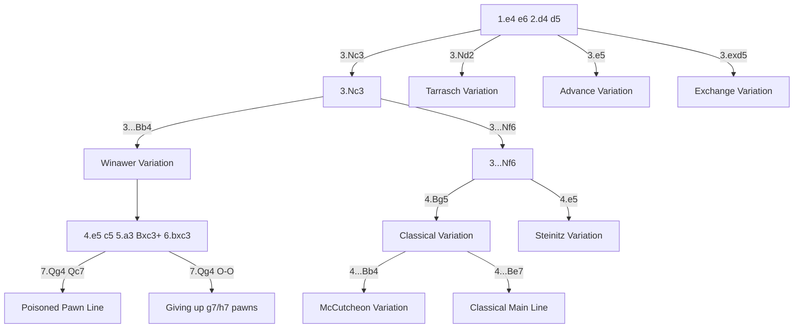

# French Defense

**1.e4 e6**

A solid, strategic opening where Black prepares ...d5 to challenge White's centre. The French creates clear pawn structures and plans for both sides. The trade-off: Black's light-squared bishop on c8 often gets locked behind the pawn chain.

**Position after 1.e4 e6 2.d4 d5 (French Defense)**

<svg viewBox="0 0 390 400" xmlns="http://www.w3.org/2000/svg" style="max-width:400px">
  <rect x="0" y="0" width="360" height="360" fill="#b58863"/>
  <rect x="0" y="0" width="45" height="45" fill="#f0d9b5"/><rect x="90" y="0" width="45" height="45" fill="#f0d9b5"/><rect x="180" y="0" width="45" height="45" fill="#f0d9b5"/><rect x="270" y="0" width="45" height="45" fill="#f0d9b5"/>
  <rect x="45" y="45" width="45" height="45" fill="#f0d9b5"/><rect x="135" y="45" width="45" height="45" fill="#f0d9b5"/><rect x="225" y="45" width="45" height="45" fill="#f0d9b5"/><rect x="315" y="45" width="45" height="45" fill="#f0d9b5"/>
  <rect x="0" y="90" width="45" height="45" fill="#f0d9b5"/><rect x="90" y="90" width="45" height="45" fill="#f0d9b5"/><rect x="180" y="90" width="45" height="45" fill="#f0d9b5"/><rect x="270" y="90" width="45" height="45" fill="#f0d9b5"/>
  <rect x="45" y="135" width="45" height="45" fill="#f0d9b5"/><rect x="135" y="135" width="45" height="45" fill="#f0d9b5"/><rect x="225" y="135" width="45" height="45" fill="#f0d9b5"/><rect x="315" y="135" width="45" height="45" fill="#f0d9b5"/>
  <rect x="0" y="180" width="45" height="45" fill="#f0d9b5"/><rect x="90" y="180" width="45" height="45" fill="#f0d9b5"/><rect x="180" y="180" width="45" height="45" fill="#f0d9b5"/><rect x="270" y="180" width="45" height="45" fill="#f0d9b5"/>
  <rect x="45" y="225" width="45" height="45" fill="#f0d9b5"/><rect x="135" y="225" width="45" height="45" fill="#f0d9b5"/><rect x="225" y="225" width="45" height="45" fill="#f0d9b5"/><rect x="315" y="225" width="45" height="45" fill="#f0d9b5"/>
  <rect x="0" y="270" width="45" height="45" fill="#f0d9b5"/><rect x="90" y="270" width="45" height="45" fill="#f0d9b5"/><rect x="180" y="270" width="45" height="45" fill="#f0d9b5"/><rect x="270" y="270" width="45" height="45" fill="#f0d9b5"/>
  <rect x="45" y="315" width="45" height="45" fill="#f0d9b5"/><rect x="135" y="315" width="45" height="45" fill="#f0d9b5"/><rect x="225" y="315" width="45" height="45" fill="#f0d9b5"/><rect x="315" y="315" width="45" height="45" fill="#f0d9b5"/>
  <!-- Pieces -->
  <text x="22" y="33" font-size="30" text-anchor="middle" font-family="sans-serif">♜</text>
  <text x="67" y="33" font-size="30" text-anchor="middle" font-family="sans-serif">♞</text>
  <text x="112" y="33" font-size="30" text-anchor="middle" font-family="sans-serif">♝</text>
  <text x="157" y="33" font-size="30" text-anchor="middle" font-family="sans-serif">♛</text>
  <text x="202" y="33" font-size="30" text-anchor="middle" font-family="sans-serif">♚</text>
  <text x="247" y="33" font-size="30" text-anchor="middle" font-family="sans-serif">♝</text>
  <text x="292" y="33" font-size="30" text-anchor="middle" font-family="sans-serif">♞</text>
  <text x="337" y="33" font-size="30" text-anchor="middle" font-family="sans-serif">♜</text>
  <text x="22" y="78" font-size="30" text-anchor="middle" font-family="sans-serif">♟</text>
  <text x="67" y="78" font-size="30" text-anchor="middle" font-family="sans-serif">♟</text>
  <text x="112" y="78" font-size="30" text-anchor="middle" font-family="sans-serif">♟</text>
  <text x="247" y="78" font-size="30" text-anchor="middle" font-family="sans-serif">♟</text>
  <text x="292" y="78" font-size="30" text-anchor="middle" font-family="sans-serif">♟</text>
  <text x="337" y="78" font-size="30" text-anchor="middle" font-family="sans-serif">♟</text>
  <text x="202" y="123" font-size="30" text-anchor="middle" font-family="sans-serif">♟</text>
  <text x="157" y="168" font-size="30" text-anchor="middle" font-family="sans-serif">♟</text>
  <text x="157" y="213" font-size="30" text-anchor="middle" font-family="sans-serif">♙</text>
  <text x="202" y="213" font-size="30" text-anchor="middle" font-family="sans-serif">♙</text>
  <text x="22" y="303" font-size="30" text-anchor="middle" font-family="sans-serif">♙</text>
  <text x="67" y="303" font-size="30" text-anchor="middle" font-family="sans-serif">♙</text>
  <text x="112" y="303" font-size="30" text-anchor="middle" font-family="sans-serif">♙</text>
  <text x="247" y="303" font-size="30" text-anchor="middle" font-family="sans-serif">♙</text>
  <text x="292" y="303" font-size="30" text-anchor="middle" font-family="sans-serif">♙</text>
  <text x="337" y="303" font-size="30" text-anchor="middle" font-family="sans-serif">♙</text>
  <text x="22" y="348" font-size="30" text-anchor="middle" font-family="sans-serif">♖</text>
  <text x="67" y="348" font-size="30" text-anchor="middle" font-family="sans-serif">♘</text>
  <text x="112" y="348" font-size="30" text-anchor="middle" font-family="sans-serif">♗</text>
  <text x="157" y="348" font-size="30" text-anchor="middle" font-family="sans-serif">♕</text>
  <text x="202" y="348" font-size="30" text-anchor="middle" font-family="sans-serif">♔</text>
  <text x="247" y="348" font-size="30" text-anchor="middle" font-family="sans-serif">♗</text>
  <text x="292" y="348" font-size="30" text-anchor="middle" font-family="sans-serif">♘</text>
  <text x="337" y="348" font-size="30" text-anchor="middle" font-family="sans-serif">♖</text>
  <!-- Coordinates -->
  <text x="22" y="375" font-size="11" fill="#666" text-anchor="middle" font-family="sans-serif">a</text>
  <text x="67" y="375" font-size="11" fill="#666" text-anchor="middle" font-family="sans-serif">b</text>
  <text x="112" y="375" font-size="11" fill="#666" text-anchor="middle" font-family="sans-serif">c</text>
  <text x="157" y="375" font-size="11" fill="#666" text-anchor="middle" font-family="sans-serif">d</text>
  <text x="202" y="375" font-size="11" fill="#666" text-anchor="middle" font-family="sans-serif">e</text>
  <text x="247" y="375" font-size="11" fill="#666" text-anchor="middle" font-family="sans-serif">f</text>
  <text x="292" y="375" font-size="11" fill="#666" text-anchor="middle" font-family="sans-serif">g</text>
  <text x="337" y="375" font-size="11" fill="#666" text-anchor="middle" font-family="sans-serif">h</text>
  <text x="370" y="33" font-size="11" fill="#666" font-family="sans-serif">8</text>
  <text x="370" y="78" font-size="11" fill="#666" font-family="sans-serif">7</text>
  <text x="370" y="123" font-size="11" fill="#666" font-family="sans-serif">6</text>
  <text x="370" y="168" font-size="11" fill="#666" font-family="sans-serif">5</text>
  <text x="370" y="213" font-size="11" fill="#666" font-family="sans-serif">4</text>
  <text x="370" y="258" font-size="11" fill="#666" font-family="sans-serif">3</text>
  <text x="370" y="303" font-size="11" fill="#666" font-family="sans-serif">2</text>
  <text x="370" y="348" font-size="11" fill="#666" font-family="sans-serif">1</text>
</svg>

> **FEN:** `rnbqkbnr/ppp2ppp/4p3/3p4/3PP3/8/PPP2PPP/RNBQKBNR w - - 0 1`

**See also:** [Caro-Kann](caro-kann.md) | [Sicilian](sicilian-defense.md) | [Middlegame — Pawn Structures](../../middlegame/pawn-structures.md)

### Variation Tree



---

## The French Pawn Chain

The defining feature of the French is the pawn chain:
- **White:** e5–d4 (after 3.e5 or exchanges leading to this structure)
- **Black:** d5–e6

Nimzowitsch's principle: **attack the base of the chain**. Black targets d4 with ...c5; White reinforces with c3.

See [Middlegame — Pawn Structures](../../middlegame/pawn-structures.md) for detailed pawn chain strategy.

---

## Winawer Variation (3...Bb4)

```
1.e4 e6 2.d4 d5 3.Nc3 Bb4 4.e5 c5 5.a3 Bxc3+ 6.bxc3 Ne7
7.Qg4 Qc7 (or 7...O-O giving up g7/h7 pawns)
```

### The Poisoned Pawn Line

```
7.Qg4 Qc7 8.Qxg7 Rg8 9.Qxh7 cxd4
```

Extraordinarily sharp — White grabs two pawns but Black gets enormous counterplay with open lines and initiative.

### Strategic Ideas

| White | Black |
|-------|-------|
| Doubled c-pawns control d4 and support the chain | ...c5 attacks the chain base |
| e5 cramps Black; castle queenside and attack | Exchange on c3 damages White's structure |
| Qg4 creates immediate threats | Counterplay on the queenside and centre |

### Famous Practitioners

Mikhail Botvinnik, Viktor Korchnoi, Maxime Vachier-Lagrave (modern Winawer champion).

---

## Classical Variation (3...Nf6 4.Bg5)

```
1.e4 e6 2.d4 d5 3.Nc3 Nf6 4.Bg5 Be7 5.e5 Nfd7 6.Bxe7 Qxe7 7.f4 O-O 8.Nf3 c5 9.Qd2 Nc6 10.O-O-O
```

### McCutcheon Variation (4...Bb4)

Black pins back with Bb4, leading to complex, double-edged play.

### Strategic Ideas

| White | Black |
|-------|-------|
| e5 cramps Black; f4 reinforces | Break the chain with ...c5 and/or ...f6 |
| Bg5 pins the knight; after Bxe7 White has the dark squares | Knight manoeuvre: Nd7–b6 or Nd7–f8–g6 |
| Castle queenside; attack kingside | Aim for the ...f6 break to challenge e5 |

### Famous Practitioners

Anatoly Karpov (as White), Boris Spassky, Viktor Korchnoi.

---

## Tarrasch Variation (3.Nd2)

```
1.e4 e6 2.d4 d5 3.Nd2 Nf6 4.e5 Nfd7 5.Bd3 c5 6.c3 Nc6 7.Ne2 cxd4 8.cxd4 f6
```

Nd2 avoids the Winawer pin and doubled pawns. The knight goes to f3 later. Considered slightly less dangerous for Black than 3.Nc3 lines.

### Famous Practitioners

Siegbert Tarrasch, Anatoly Karpov.

---

## Advance Variation (3.e5)

```
1.e4 e6 2.d4 d5 3.e5 c5 4.c3 Nc6 5.Nf3 Qb6 6.Be2 cxd4 7.cxd4 Nh6
```

### Strategic Ideas

| White | Black |
|-------|-------|
| Lock the centre and attack kingside | Attack the chain base with ...c5, later ...f6 |
| f4 reinforces e5; pawn storm possible | ...Qb6 pressures d4 and b2 |
| Space advantage | Nh6–f5 targets d4 |

### Who Should Play It

Players who want clear plans. The Advance is easier to play for White than main lines — the strategy is straightforward.

---

## Exchange Variation (3.exd5 exd5)

```
1.e4 e6 2.d4 d5 3.exd5 exd5 4.Nf3 Nf6 5.Bd3 Bd6 6.O-O O-O
```

Symmetric centre, roughly equal chances. Black's "bad bishop" problem is solved since the c8–h3 diagonal is open. Often used for quick draws or low-risk games.

---

## The "Bad Bishop" Problem

The light-squared bishop on c8 is the chronic issue of the French. Solutions:

1. **Winawer:** Trade the dark-squared bishop instead, keeping structural compensation
2. **Tartakower ...b6/...Ba6:** Develop via b7 or a6
3. **Exchange Variation:** The diagonal opens naturally
4. **...c5 and ...Qb6:** Active play makes the bishop less relevant

See [Middlegame — Good vs Bad Bishops](../../middlegame/piece-activity.md) for the general concept.

---

**Next:** [Caro-Kann Defense](caro-kann.md) | **Back to:** [Openings Index](../index.md)
