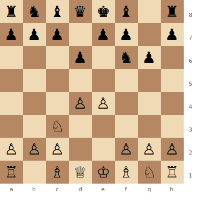
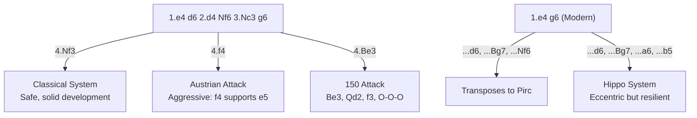

# Pirc Defense & Modern Defense

## Pirc Defense

**1.e4 d6 2.d4 Nf6 3.Nc3 g6**

## Modern Defense

**1.e4 g6** (delaying ...d6 and ...Nf6)

Both are **hypermodern** openings — Black allows White to build a big centre, then attacks it from the flanks. The fianchettoed bishop on g7 is the centrepiece of Black's strategy.

**Position after 1.e4 d6 2.d4 Nf6 3.Nc3 g6 (Pirc Defense)**



> **FEN:** `rnbqkb1r/ppp1pp1p/3p1np1/8/3PP3/2N5/PPP2PPP/R1BQKBNR w - - 0 1`

**See also:** [Alekhine's Defense](alekhines-defense.md) | [King's Indian Defense](../indian-defenses/kings-indian.md) | [Fundamentals — Centre Control](../../fundamentals/centre-control.md)

### Variation Tree



---

## Classical System (4.Nf3)

```
1.e4 d6 2.d4 Nf6 3.Nc3 g6 4.Nf3 Bg7 5.Be2 O-O 6.O-O c6 7.Re1
```

White develops normally. Plans include e5 push or Bg5 with central play. A safe, solid approach.

## Austrian Attack (4.f4)

```
1.e4 d6 2.d4 Nf6 3.Nc3 g6 4.f4 Bg7 5.Nf3 O-O 6.e5
```

The most principled and aggressive response — "if you let me have the centre, I'll use it." White plays f4 to support e5, gaining massive space.

### Strategic Ideas

| White | Black |
|-------|-------|
| Occupy the centre with e4 + d4 + f4 | Allow the big centre, then undermine it |
| Attack with the space advantage | ...c5, ...e5, or ...d5 pawn breaks |
| Austrian Attack is the critical test | Bg7 is a powerful long-diagonal piece |

## 150 Attack (4.Be3, 5.Qd2, 6.f3)

```
4.Be3 Bg7 5.Qd2 O-O 6.f3 c6 (or a6) 7.O-O-O b5
```

Named because "any player rated 150 ECF can play it" — White castles queenside and storms the kingside. Simple but effective.

---

## Modern Defense Specifics

The Modern (1.e4 g6, without early ...Nf6) is even more provocative. Black might play ...d6, ...Bg7, ...a6, ...b5 before developing the knight, keeping maximum flexibility.

### Hippo System

Black plays ...g6, ...Bg7, ...d6, ...e6, ...Ne7, ...b6, ...Bb7, ...Nd7 — developing everything behind the pawns in a "hippopotamus" formation. Eccentric but surprisingly resilient.

---

## Famous Practitioners

Viktor Korchnoi, Vasily Ivanchuk, Richard Rapport, Tiger Hillarp Persson (Modern Defense specialist).

## Who Should Play It

Players who understand hypermodern concepts and are comfortable letting the opponent build a centre before striking. Risky but flexible.

## Historical Note

The Pirc features in one of the greatest games ever played: [Kasparov vs Topalov, 1999](../../famous-games/kasparov-topalov.md).

---

**Next:** [Alekhine's Defense](alekhines-defense.md) | **Back to:** [Openings Index](../index.md)
