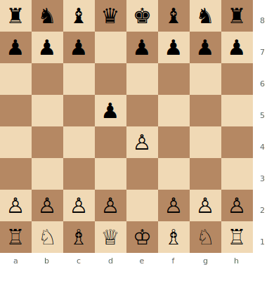

# Scandinavian Defense (Centre Counter)

**1.e4 d5**

The most direct challenge to 1.e4. Black immediately strikes at the centre. The trade-off is that after 2.exd5 Qxd5, the queen comes out early and White gains tempo with Nc3.

**Position after 1.e4 d5 (Scandinavian Defense)**



> **FEN:** `rnbqkbnr/ppp1pppp/8/3p4/4P3/8/PPPP1PPP/RNBQKBNR w - - 0 1`

**See also:** [Caro-Kann](caro-kann.md) | [French Defense](french-defense.md) | [Fundamentals — Development](../../fundamentals/development.md)

---

## Main Line (3...Qa5)

```
1.e4 d5 2.exd5 Qxd5 3.Nc3 Qa5 4.d4 Nf6 5.Nf3 Bf5 6.Bc4 e6 7.Bd2 c6
```

### Strategic Ideas

| White | Black |
|-------|-------|
| Gain a tempo with Nc3 attacking the queen | Develop solidly: ...Nf6, ...Bf5, ...e6, ...c6 |
| Build a strong centre with d4 | The queen on a5 is relatively safe |
| White should have a comfortable edge | Simple, practical development scheme |

## Gubinsky-Melts Variation (3...Qd6)

```
1.e4 d5 2.exd5 Qxd5 3.Nc3 Qd6
```

More modern — the queen on d6 doesn't block the c8 bishop. Black can play ...Bf5 naturally.

## Marshall Gambit (2...Nf6)

```
1.e4 d5 2.exd5 Nf6 3.d4 Nxd5 (or 3...Bg4)
```

Black recaptures with the knight instead of the queen, avoiding the tempo loss. Leads to different types of positions.

---

## Famous Practitioners

Bent Larsen, Curt Hansen, Nils Grandelius.

## Who Should Play It

Players who want a simple, easy-to-learn system against 1.e4. Less ambitious but very practical, especially at club level. Minimal theory required.

---

**Back to:** [Openings Index](../index.md)
