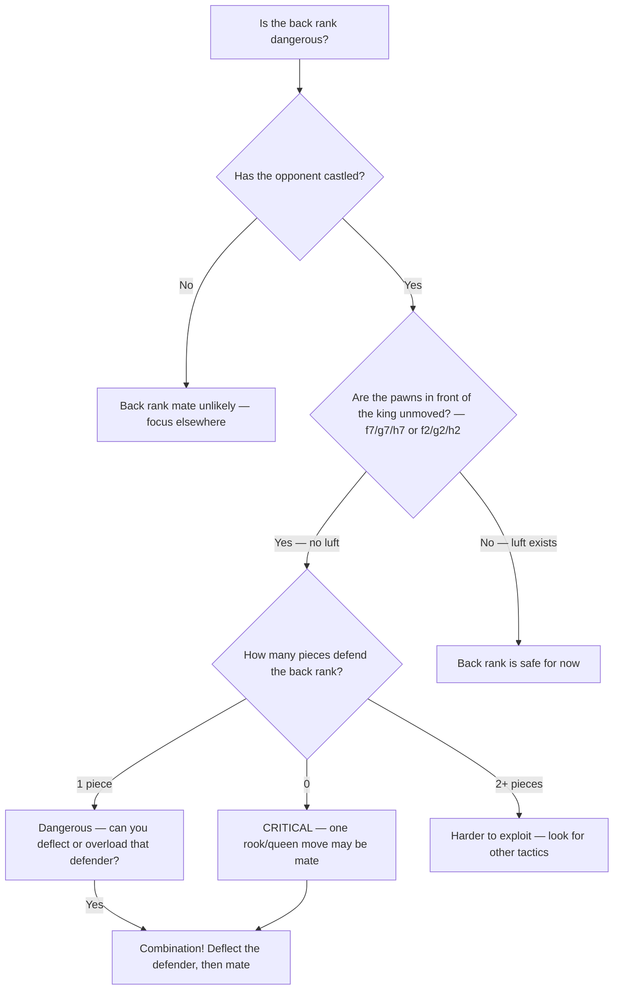

# Back Rank Tactics

**Back rank mate** occurs when a rook or queen delivers checkmate on the opponent's first rank (8th rank for Black, 1st rank for White), and the king is trapped by its own pawns.

**See also:** [Mating Patterns](mating-patterns.md) | [Overloaded Pieces](overloaded-pieces.md) | [Deflection & Decoy](deflection-decoy.md) | [Famous Games — The Opera Game](../famous-games/opera-game.md)

---

## The Basic Pattern

**White to play: Rd8# is back rank mate:**

<svg viewBox="0 0 390 400" xmlns="http://www.w3.org/2000/svg" style="max-width:400px">
  <rect x="0" y="0" width="360" height="360" fill="#b58863"/>
  <rect x="0" y="0" width="45" height="45" fill="#f0d9b5"/><rect x="90" y="0" width="45" height="45" fill="#f0d9b5"/><rect x="180" y="0" width="45" height="45" fill="#f0d9b5"/><rect x="270" y="0" width="45" height="45" fill="#f0d9b5"/>
  <rect x="45" y="45" width="45" height="45" fill="#f0d9b5"/><rect x="135" y="45" width="45" height="45" fill="#f0d9b5"/><rect x="225" y="45" width="45" height="45" fill="#f0d9b5"/><rect x="315" y="45" width="45" height="45" fill="#f0d9b5"/>
  <rect x="0" y="90" width="45" height="45" fill="#f0d9b5"/><rect x="90" y="90" width="45" height="45" fill="#f0d9b5"/><rect x="180" y="90" width="45" height="45" fill="#f0d9b5"/><rect x="270" y="90" width="45" height="45" fill="#f0d9b5"/>
  <rect x="45" y="135" width="45" height="45" fill="#f0d9b5"/><rect x="135" y="135" width="45" height="45" fill="#f0d9b5"/><rect x="225" y="135" width="45" height="45" fill="#f0d9b5"/><rect x="315" y="135" width="45" height="45" fill="#f0d9b5"/>
  <rect x="0" y="180" width="45" height="45" fill="#f0d9b5"/><rect x="90" y="180" width="45" height="45" fill="#f0d9b5"/><rect x="180" y="180" width="45" height="45" fill="#f0d9b5"/><rect x="270" y="180" width="45" height="45" fill="#f0d9b5"/>
  <rect x="45" y="225" width="45" height="45" fill="#f0d9b5"/><rect x="135" y="225" width="45" height="45" fill="#f0d9b5"/><rect x="225" y="225" width="45" height="45" fill="#f0d9b5"/><rect x="315" y="225" width="45" height="45" fill="#f0d9b5"/>
  <rect x="0" y="270" width="45" height="45" fill="#f0d9b5"/><rect x="90" y="270" width="45" height="45" fill="#f0d9b5"/><rect x="180" y="270" width="45" height="45" fill="#f0d9b5"/><rect x="270" y="270" width="45" height="45" fill="#f0d9b5"/>
  <rect x="45" y="315" width="45" height="45" fill="#f0d9b5"/><rect x="135" y="315" width="45" height="45" fill="#f0d9b5"/><rect x="225" y="315" width="45" height="45" fill="#f0d9b5"/><rect x="315" y="315" width="45" height="45" fill="#f0d9b5"/>
  <rect x="135" y="0" width="45" height="45" fill="#d63031" opacity="0.35"/>
  <defs><marker id="ah" markerWidth="10" markerHeight="7" refX="10" refY="3.5" orient="auto"><polygon points="0 0,10 3.5,0 7" fill="#d63031"/></marker></defs>
  <text x="292" y="33" font-size="30" text-anchor="middle" dominant-baseline="central" font-family="serif">♚</text>
  <text x="247" y="78" font-size="30" text-anchor="middle" dominant-baseline="central" font-family="serif">♟</text>
  <text x="292" y="78" font-size="30" text-anchor="middle" dominant-baseline="central" font-family="serif">♟</text>
  <text x="337" y="78" font-size="30" text-anchor="middle" dominant-baseline="central" font-family="serif">♟</text>
  <text x="157" y="348" font-size="30" text-anchor="middle" dominant-baseline="central" font-family="serif">♖</text>
  <text x="292" y="348" font-size="30" text-anchor="middle" dominant-baseline="central" font-family="serif">♔</text>
  <line x1="157" y1="337" x2="157" y2="22" stroke="#d63031" stroke-width="3" marker-end="url(#ah)"/>
  <text x="22" y="375" font-size="11" fill="#666" text-anchor="middle" font-family="sans-serif">a</text>
  <text x="67" y="375" font-size="11" fill="#666" text-anchor="middle" font-family="sans-serif">b</text>
  <text x="112" y="375" font-size="11" fill="#666" text-anchor="middle" font-family="sans-serif">c</text>
  <text x="157" y="375" font-size="11" fill="#666" text-anchor="middle" font-family="sans-serif">d</text>
  <text x="202" y="375" font-size="11" fill="#666" text-anchor="middle" font-family="sans-serif">e</text>
  <text x="247" y="375" font-size="11" fill="#666" text-anchor="middle" font-family="sans-serif">f</text>
  <text x="292" y="375" font-size="11" fill="#666" text-anchor="middle" font-family="sans-serif">g</text>
  <text x="337" y="375" font-size="11" fill="#666" text-anchor="middle" font-family="sans-serif">h</text>
  <text x="370" y="33" font-size="11" fill="#666" font-family="sans-serif">8</text>
  <text x="370" y="78" font-size="11" fill="#666" font-family="sans-serif">7</text>
  <text x="370" y="123" font-size="11" fill="#666" font-family="sans-serif">6</text>
  <text x="370" y="168" font-size="11" fill="#666" font-family="sans-serif">5</text>
  <text x="370" y="213" font-size="11" fill="#666" font-family="sans-serif">4</text>
  <text x="370" y="258" font-size="11" fill="#666" font-family="sans-serif">3</text>
  <text x="370" y="303" font-size="11" fill="#666" font-family="sans-serif">2</text>
  <text x="370" y="348" font-size="11" fill="#666" font-family="sans-serif">1</text>
</svg>

> **FEN:** `6k1/5ppp/8/8/8/8/8/3R2K1 w - - 0 1`

After Rd8#, the rook delivers mate on the 8th rank. The king on g8 cannot escape: f8 and h8 are controlled by the rook, and f7, g7, h7 are blocked by its own pawns.

---

## Why It Happens

After castling kingside, the king typically sits on g1/g8 behind pawns on f2/f7, g2/g7, h2/h7. If none of these pawns have moved, the king has **no escape squares** — it's trapped by its own army.

---

## Creating Luft (Escape Square)

**Luft** (German: "air") is a preventive measure — advancing one of the pawns (typically h3/h6) to give the king an escape square.

```
After h3, the king can escape to h2 if the back rank is threatened.
```

**When to play h3/h6:**
- When your pieces are actively placed and you have a spare tempo
- When the opponent has rooks on open files aimed at your back rank
- Before it becomes urgent — proactive luft is safer than reactive

---

## Back Rank Combinations

### Deflection into Back Rank Mate

The most common combination: deflect the piece guarding the back rank.

```
Black's Rf8 guards the back rank. White's rook is on d1.
White plays Qf7! — if Rxf7, then Rd8# (back rank mate).
The queen deflects the rook from its guard duty.
```

### Overloaded Piece + Back Rank

```
Black's Queen on c7 guards the back rank AND defends c6.
White plays Rxc6! — if Qxc6, Rd8# (back rank). If Black doesn't take, White wins the c6 pawn/piece.
```

### Sacrifice to Open the Back Rank

```
Black has a rook on d8 blocking White's access.
White plays Rxd8+ Rxd8. Now White plays Re8+! Rxe8, and a second rook or queen delivers mate.
```

---

## Back Rank Vulnerability Checklist



## Practical Advice

- **Always be aware of your back rank** — scan for weakness before entering combinations
- **Create luft early** in positions where back rank problems could arise
- **When ahead in material**, be especially careful — opponents often have back rank tricks as last-ditch resources
- Back rank awareness should be automatic — like checking your mirrors while driving

---

**Next:** [Trapped Pieces](trapped-pieces.md) | **Back to:** [Tactics Index](index.md)
