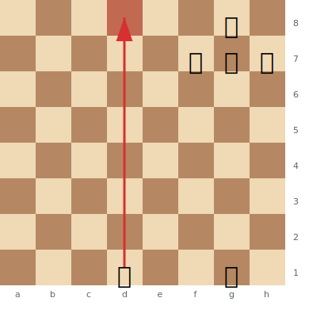
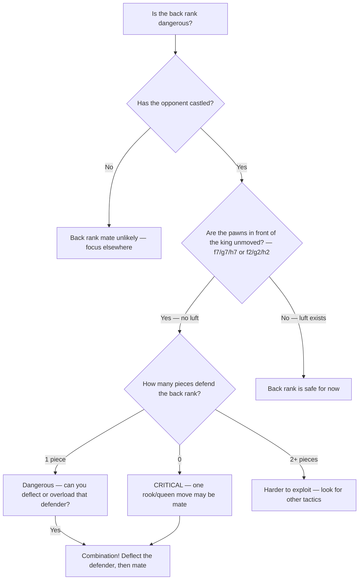

# Back Rank Tactics

**Back rank mate** occurs when a rook or queen delivers checkmate on the opponent's first rank (8th rank for Black, 1st rank for White), and the king is trapped by its own pawns.

**See also:** [Mating Patterns](mating-patterns.md) | [Overloaded Pieces](overloaded-pieces.md) | [Deflection & Decoy](deflection-decoy.md) | [Famous Games — The Opera Game](../famous-games/opera-game.md)

---

## The Basic Pattern

**White to play: Rd8# is back rank mate:**



> **FEN:** `6k1/5ppp/8/8/8/8/8/3R2K1 w - - 0 1`

After Rd8#, the rook delivers mate on the 8th rank. The king on g8 cannot escape: f8 and h8 are controlled by the rook, and f7, g7, h7 are blocked by its own pawns.

---

## Why It Happens

After castling kingside, the king typically sits on g1/g8 behind pawns on f2/f7, g2/g7, h2/h7. If none of these pawns have moved, the king has **no escape squares** — it's trapped by its own army.

---

## Creating Luft (Escape Square)

**Luft** (German: "air") is a preventive measure — advancing one of the pawns (typically h3/h6) to give the king an escape square.

```
After h3, the king can escape to h2 if the back rank is threatened.
```

**When to play h3/h6:**
- When your pieces are actively placed and you have a spare tempo
- When the opponent has rooks on open files aimed at your back rank
- Before it becomes urgent — proactive luft is safer than reactive

---

## Back Rank Combinations

### Deflection into Back Rank Mate

The most common combination: deflect the piece guarding the back rank.

```
Black's Rf8 guards the back rank. White's rook is on d1.
White plays Qf7! — if Rxf7, then Rd8# (back rank mate).
The queen deflects the rook from its guard duty.
```

### Overloaded Piece + Back Rank

```
Black's Queen on c7 guards the back rank AND defends c6.
White plays Rxc6! — if Qxc6, Rd8# (back rank). If Black doesn't take, White wins the c6 pawn/piece.
```

### Sacrifice to Open the Back Rank

```
Black has a rook on d8 blocking White's access.
White plays Rxd8+ Rxd8. Now White plays Re8+! Rxe8, and a second rook or queen delivers mate.
```

---

## Back Rank Vulnerability Checklist



## Practical Advice

- **Always be aware of your back rank** — scan for weakness before entering combinations
- **Create luft early** in positions where back rank problems could arise
- **When ahead in material**, be especially careful — opponents often have back rank tricks as last-ditch resources
- Back rank awareness should be automatic — like checking your mirrors while driving

---

**Next:** [Trapped Pieces](trapped-pieces.md) | **Back to:** [Tactics Index](index.md)
