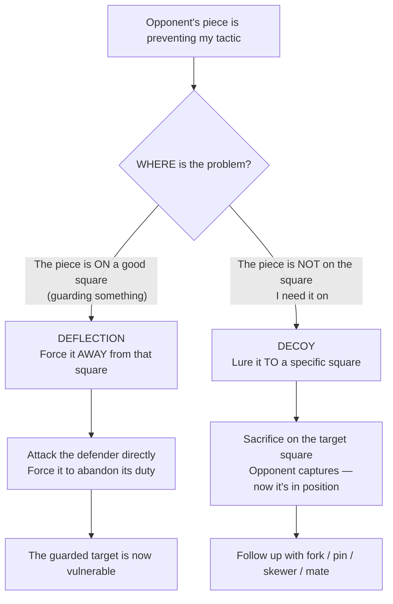

# Deflection & Decoy

Two related tactics that manipulate where enemy pieces stand.

**See also:** [Removing the Defender](removing-the-defender.md) | [Overloaded Pieces](overloaded-pieces.md) | [Zwischenzug](zwischenzug.md)

---

## Deflection

**Deflection** forces an enemy piece away from a square or line where it performs an important defensive duty.

### How It Works

A defender is guarding a key square or piece. You attack that defender, forcing it to move — and the thing it was guarding becomes vulnerable.

### Example

**White to play: Qf8! deflects the rook from guarding the back rank:**

<svg viewBox="0 0 390 400" xmlns="http://www.w3.org/2000/svg" style="max-width:400px">
  <rect x="0" y="0" width="360" height="360" fill="#b58863"/>
  <rect x="0" y="0" width="45" height="45" fill="#f0d9b5"/><rect x="90" y="0" width="45" height="45" fill="#f0d9b5"/><rect x="180" y="0" width="45" height="45" fill="#f0d9b5"/><rect x="270" y="0" width="45" height="45" fill="#f0d9b5"/>
  <rect x="45" y="45" width="45" height="45" fill="#f0d9b5"/><rect x="135" y="45" width="45" height="45" fill="#f0d9b5"/><rect x="225" y="45" width="45" height="45" fill="#f0d9b5"/><rect x="315" y="45" width="45" height="45" fill="#f0d9b5"/>
  <rect x="0" y="90" width="45" height="45" fill="#f0d9b5"/><rect x="90" y="90" width="45" height="45" fill="#f0d9b5"/><rect x="180" y="90" width="45" height="45" fill="#f0d9b5"/><rect x="270" y="90" width="45" height="45" fill="#f0d9b5"/>
  <rect x="45" y="135" width="45" height="45" fill="#f0d9b5"/><rect x="135" y="135" width="45" height="45" fill="#f0d9b5"/><rect x="225" y="135" width="45" height="45" fill="#f0d9b5"/><rect x="315" y="135" width="45" height="45" fill="#f0d9b5"/>
  <rect x="0" y="180" width="45" height="45" fill="#f0d9b5"/><rect x="90" y="180" width="45" height="45" fill="#f0d9b5"/><rect x="180" y="180" width="45" height="45" fill="#f0d9b5"/><rect x="270" y="180" width="45" height="45" fill="#f0d9b5"/>
  <rect x="45" y="225" width="45" height="45" fill="#f0d9b5"/><rect x="135" y="225" width="45" height="45" fill="#f0d9b5"/><rect x="225" y="225" width="45" height="45" fill="#f0d9b5"/><rect x="315" y="225" width="45" height="45" fill="#f0d9b5"/>
  <rect x="0" y="270" width="45" height="45" fill="#f0d9b5"/><rect x="90" y="270" width="45" height="45" fill="#f0d9b5"/><rect x="180" y="270" width="45" height="45" fill="#f0d9b5"/><rect x="270" y="270" width="45" height="45" fill="#f0d9b5"/>
  <rect x="45" y="315" width="45" height="45" fill="#f0d9b5"/><rect x="135" y="315" width="45" height="45" fill="#f0d9b5"/><rect x="225" y="315" width="45" height="45" fill="#f0d9b5"/><rect x="315" y="315" width="45" height="45" fill="#f0d9b5"/>
  <rect x="225" y="0" width="45" height="45" fill="#d63031" opacity="0.35"/>
  <defs><marker id="ah" markerWidth="10" markerHeight="7" refX="10" refY="3.5" orient="auto"><polygon points="0 0,10 3.5,0 7" fill="#d63031"/></marker></defs>
  <text x="247" y="33" font-size="30" text-anchor="middle" dominant-baseline="central" font-family="serif">♜</text>
  <text x="292" y="33" font-size="30" text-anchor="middle" dominant-baseline="central" font-family="serif">♚</text>
  <text x="292" y="78" font-size="30" text-anchor="middle" dominant-baseline="central" font-family="serif">♟</text>
  <text x="337" y="78" font-size="30" text-anchor="middle" dominant-baseline="central" font-family="serif">♟</text>
  <text x="247" y="303" font-size="30" text-anchor="middle" dominant-baseline="central" font-family="serif">♕</text>
  <text x="157" y="348" font-size="30" text-anchor="middle" dominant-baseline="central" font-family="serif">♖</text>
  <text x="292" y="348" font-size="30" text-anchor="middle" dominant-baseline="central" font-family="serif">♔</text>
  <line x1="247" y1="292" x2="247" y2="22" stroke="#d63031" stroke-width="3" marker-end="url(#ah)"/>
  <line x1="157" y1="337" x2="157" y2="22" stroke="#d63031" stroke-width="3" marker-end="url(#ah)" stroke-dasharray="6,4"/>
  <text x="22" y="375" font-size="11" fill="#666" text-anchor="middle" font-family="sans-serif">a</text>
  <text x="67" y="375" font-size="11" fill="#666" text-anchor="middle" font-family="sans-serif">b</text>
  <text x="112" y="375" font-size="11" fill="#666" text-anchor="middle" font-family="sans-serif">c</text>
  <text x="157" y="375" font-size="11" fill="#666" text-anchor="middle" font-family="sans-serif">d</text>
  <text x="202" y="375" font-size="11" fill="#666" text-anchor="middle" font-family="sans-serif">e</text>
  <text x="247" y="375" font-size="11" fill="#666" text-anchor="middle" font-family="sans-serif">f</text>
  <text x="292" y="375" font-size="11" fill="#666" text-anchor="middle" font-family="sans-serif">g</text>
  <text x="337" y="375" font-size="11" fill="#666" text-anchor="middle" font-family="sans-serif">h</text>
  <text x="370" y="33" font-size="11" fill="#666" font-family="sans-serif">8</text>
  <text x="370" y="78" font-size="11" fill="#666" font-family="sans-serif">7</text>
  <text x="370" y="123" font-size="11" fill="#666" font-family="sans-serif">6</text>
  <text x="370" y="168" font-size="11" fill="#666" font-family="sans-serif">5</text>
  <text x="370" y="213" font-size="11" fill="#666" font-family="sans-serif">4</text>
  <text x="370" y="258" font-size="11" fill="#666" font-family="sans-serif">3</text>
  <text x="370" y="303" font-size="11" fill="#666" font-family="sans-serif">2</text>
  <text x="370" y="348" font-size="11" fill="#666" font-family="sans-serif">1</text>
</svg>

> **FEN:** `5rk1/6pp/8/8/8/8/5Q2/3R2K1 w - - 0 1`

White plays Qxf8+! If Kxf8, then Rd8# is back rank mate. If Rxf8, then Rd8+ Rxd8# also mates. The queen sacrifice deflects the defender of the 8th rank.

### Common Deflection Targets

- Pieces defending the back rank (see [Back Rank Tactics](back-rank.md))
- Knights or bishops guarding key squares
- Queens that are doing too much ([Overloaded Pieces](overloaded-pieces.md))

---

## Decoy

**Decoy** (or **attraction**) lures an enemy piece to a specific square where it becomes vulnerable — typically to a [fork](forks.md), [pin](pins.md), or [skewer](skewers.md).

### How It Works

You sacrifice material (often a queen or rook) on a square. When the opponent captures, their piece is now on that specific square — exactly where you want it for the follow-up tactic.

### Example

```
White plays Qd8+! (sacrificing the queen on d8).
Black: Kxd8. Now White plays Nf7+ — a fork winning the queen/rook that recaptured.
The queen sacrifice decoyed the king to d8 where the fork works.
```

---

## Deflection vs Decoy

| Deflection | Decoy |
|------------|-------|
| Forces a piece **away** from a good square | Lures a piece **to** a bad square |
| The key square becomes unguarded | The piece lands where it's vulnerable |
| "Get away from there!" | "Come right here!" |

---

## Queen Sacrifices as Deflection/Decoy

The most spectacular instances of these tactics involve queen sacrifices:

- **[Opera Game](../famous-games/opera-game.md):** Morphy's Qb8+! deflects the knight, allowing Rd8# (back rank mate)
- **[Game of the Century](../famous-games/game-of-century.md):** Fischer's Be6!! decoys White's queen to a square where it can't prevent the combination

---

## Thought Process: Deflection or Decoy?



## Practical Advice

- Ask: "What is this piece defending? Can I force it away?"
- Ask: "If this piece were on square X, would I have a winning tactic? Can I lure it there?"
- Deflections and decoys are the reason queen sacrifices are possible — the sacrifice forces the critical displacement

---

**Next:** [Overloaded Pieces](overloaded-pieces.md) | **Back to:** [Tactics Index](index.md)
