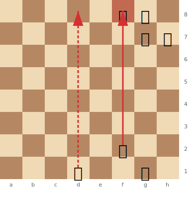
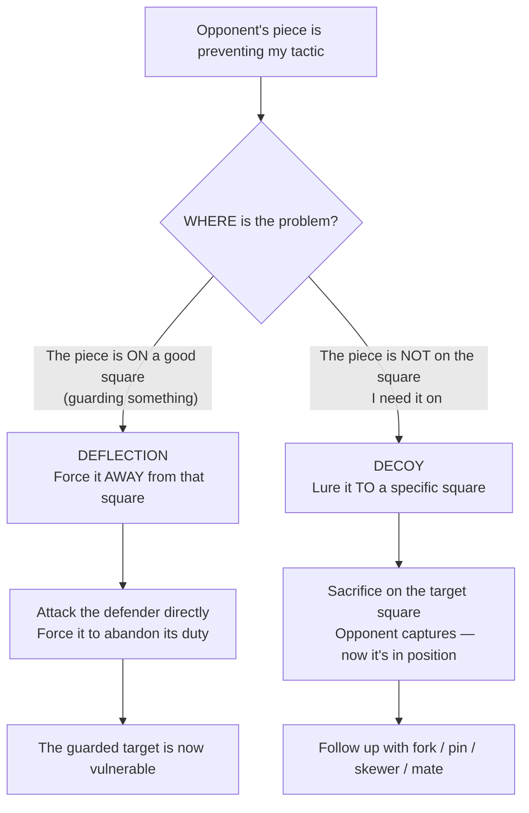

# Deflection & Decoy

Two related tactics that manipulate where enemy pieces stand.

**See also:** [Removing the Defender](removing-the-defender.md) | [Overloaded Pieces](overloaded-pieces.md) | [Zwischenzug](zwischenzug.md)

---

## Deflection

**Deflection** forces an enemy piece away from a square or line where it performs an important defensive duty.

### How It Works

A defender is guarding a key square or piece. You attack that defender, forcing it to move — and the thing it was guarding becomes vulnerable.

### Example

**White to play: Qf8! deflects the rook from guarding the back rank:**



> **FEN:** `5rk1/6pp/8/8/8/8/5Q2/3R2K1 w - - 0 1`

White plays Qxf8+! If Kxf8, then Rd8# is back rank mate. If Rxf8, then Rd8+ Rxd8# also mates. The queen sacrifice deflects the defender of the 8th rank.

### Common Deflection Targets

- Pieces defending the back rank (see [Back Rank Tactics](back-rank.md))
- Knights or bishops guarding key squares
- Queens that are doing too much ([Overloaded Pieces](overloaded-pieces.md))

---

## Decoy

**Decoy** (or **attraction**) lures an enemy piece to a specific square where it becomes vulnerable — typically to a [fork](forks.md), [pin](pins.md), or [skewer](skewers.md).

### How It Works

You sacrifice material (often a queen or rook) on a square. When the opponent captures, their piece is now on that specific square — exactly where you want it for the follow-up tactic.

### Example

```
White plays Qd8+! (sacrificing the queen on d8).
Black: Kxd8. Now White plays Nf7+ — a fork winning the queen/rook that recaptured.
The queen sacrifice decoyed the king to d8 where the fork works.
```

---

## Deflection vs Decoy

| Deflection | Decoy |
|------------|-------|
| Forces a piece **away** from a good square | Lures a piece **to** a bad square |
| The key square becomes unguarded | The piece lands where it's vulnerable |
| "Get away from there!" | "Come right here!" |

---

## Queen Sacrifices as Deflection/Decoy

The most spectacular instances of these tactics involve queen sacrifices:

- **[Opera Game](../famous-games/opera-game.md):** Morphy's Qb8+! deflects the knight, allowing Rd8# (back rank mate)
- **[Game of the Century](../famous-games/game-of-century.md):** Fischer's Be6!! decoys White's queen to a square where it can't prevent the combination

---

## Thought Process: Deflection or Decoy?



## Practical Advice

- Ask: "What is this piece defending? Can I force it away?"
- Ask: "If this piece were on square X, would I have a winning tactic? Can I lure it there?"
- Deflections and decoys are the reason queen sacrifices are possible — the sacrifice forces the critical displacement

---

**Next:** [Overloaded Pieces](overloaded-pieces.md) | **Back to:** [Tactics Index](index.md)
