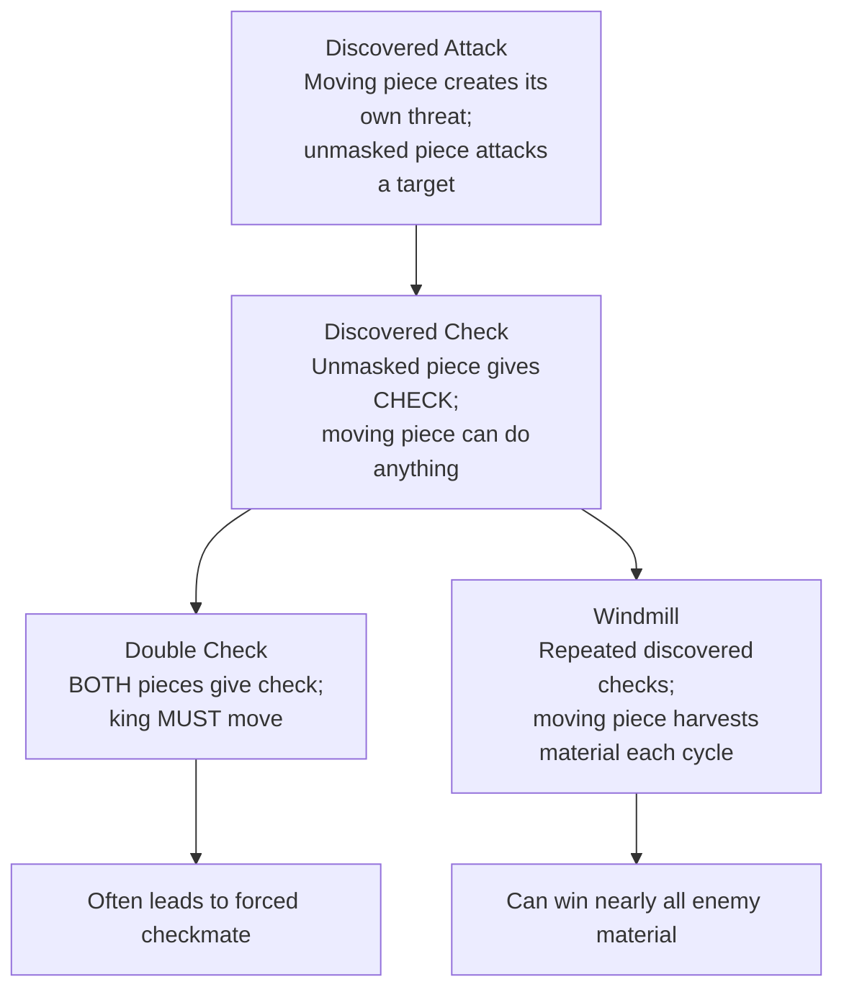

# Discovered Attacks & Discovered Checks

A **discovered attack** occurs when a piece moves out of the way of another piece, "unmasking" an attack from the piece behind it. When the unmasked attack is a check, it's called a **discovered check** — one of the most powerful tactical devices in chess.

**See also:** [Double Checks](double-checks.md) | [Pins](pins.md) | [Skewers](skewers.md)

---

## How Discovered Attacks Work

```
Setup: White Bc1, White Nd4, Black Qg5.
If White moves Nd4 elsewhere, the Bc1 is "discovered" — it now attacks the Qg5.
```

The key: the moving piece can go anywhere — including making its own threat. This means you get **two threats at once**: the discovered attack plus whatever the moving piece does.

### Escalation Hierarchy

Discovered attacks form a hierarchy of increasing power:



---

## Discovered Check

When the unmasked piece gives check, the opponent **must** deal with the check. Meanwhile, the moving piece can capture anything — even the queen — because the opponent has no choice but to address the check first.

<svg viewBox="0 0 390 400" xmlns="http://www.w3.org/2000/svg" style="max-width:400px">
  <rect x="0" y="0" width="360" height="360" fill="#b58863"/>
  <rect x="0" y="0" width="45" height="45" fill="#f0d9b5"/><rect x="90" y="0" width="45" height="45" fill="#f0d9b5"/><rect x="180" y="0" width="45" height="45" fill="#f0d9b5"/><rect x="270" y="0" width="45" height="45" fill="#f0d9b5"/>
  <rect x="45" y="45" width="45" height="45" fill="#f0d9b5"/><rect x="135" y="45" width="45" height="45" fill="#f0d9b5"/><rect x="225" y="45" width="45" height="45" fill="#f0d9b5"/><rect x="315" y="45" width="45" height="45" fill="#f0d9b5"/>
  <rect x="0" y="90" width="45" height="45" fill="#f0d9b5"/><rect x="90" y="90" width="45" height="45" fill="#f0d9b5"/><rect x="180" y="90" width="45" height="45" fill="#f0d9b5"/><rect x="270" y="90" width="45" height="45" fill="#f0d9b5"/>
  <rect x="45" y="135" width="45" height="45" fill="#f0d9b5"/><rect x="135" y="135" width="45" height="45" fill="#f0d9b5"/><rect x="225" y="135" width="45" height="45" fill="#f0d9b5"/><rect x="315" y="135" width="45" height="45" fill="#f0d9b5"/>
  <rect x="0" y="180" width="45" height="45" fill="#f0d9b5"/><rect x="90" y="180" width="45" height="45" fill="#f0d9b5"/><rect x="180" y="180" width="45" height="45" fill="#f0d9b5"/><rect x="270" y="180" width="45" height="45" fill="#f0d9b5"/>
  <rect x="45" y="225" width="45" height="45" fill="#f0d9b5"/><rect x="135" y="225" width="45" height="45" fill="#f0d9b5"/><rect x="225" y="225" width="45" height="45" fill="#f0d9b5"/><rect x="315" y="225" width="45" height="45" fill="#f0d9b5"/>
  <rect x="0" y="270" width="45" height="45" fill="#f0d9b5"/><rect x="90" y="270" width="45" height="45" fill="#f0d9b5"/><rect x="180" y="270" width="45" height="45" fill="#f0d9b5"/><rect x="270" y="270" width="45" height="45" fill="#f0d9b5"/>
  <rect x="45" y="315" width="45" height="45" fill="#f0d9b5"/><rect x="135" y="315" width="45" height="45" fill="#f0d9b5"/><rect x="225" y="315" width="45" height="45" fill="#f0d9b5"/><rect x="315" y="315" width="45" height="45" fill="#f0d9b5"/>
  <rect x="45" y="45" width="45" height="45" fill="#d63031" opacity="0.35"/>
  <rect x="135" y="0" width="45" height="45" fill="#d63031" opacity="0.35"/>
  <defs><marker id="ah" markerWidth="10" markerHeight="7" refX="10" refY="3.5" orient="auto"><polygon points="0 0,10 3.5,0 7" fill="#d63031"/></marker></defs>
  <text x="157" y="33" font-size="30" text-anchor="middle" dominant-baseline="central" font-family="serif">♚</text>
  <text x="67" y="78" font-size="30" text-anchor="middle" dominant-baseline="central" font-family="serif">♟</text>
  <text x="247" y="168" font-size="30" text-anchor="middle" dominant-baseline="central" font-family="serif">♛</text>
  <text x="247" y="258" font-size="30" text-anchor="middle" dominant-baseline="central" font-family="serif">♗</text>
  <text x="157" y="348" font-size="30" text-anchor="middle" dominant-baseline="central" font-family="serif">♖</text>
  <text x="292" y="348" font-size="30" text-anchor="middle" dominant-baseline="central" font-family="serif">♔</text>
  <line x1="247" y1="247" x2="67" y2="67" stroke="#d63031" stroke-width="3" marker-end="url(#ah)"/>
  <line x1="157" y1="337" x2="157" y2="22" stroke="#d63031" stroke-width="3" marker-end="url(#ah)" stroke-dasharray="6,4"/>
  <text x="22" y="375" font-size="11" fill="#666" text-anchor="middle" font-family="sans-serif">a</text>
  <text x="67" y="375" font-size="11" fill="#666" text-anchor="middle" font-family="sans-serif">b</text>
  <text x="112" y="375" font-size="11" fill="#666" text-anchor="middle" font-family="sans-serif">c</text>
  <text x="157" y="375" font-size="11" fill="#666" text-anchor="middle" font-family="sans-serif">d</text>
  <text x="202" y="375" font-size="11" fill="#666" text-anchor="middle" font-family="sans-serif">e</text>
  <text x="247" y="375" font-size="11" fill="#666" text-anchor="middle" font-family="sans-serif">f</text>
  <text x="292" y="375" font-size="11" fill="#666" text-anchor="middle" font-family="sans-serif">g</text>
  <text x="337" y="375" font-size="11" fill="#666" text-anchor="middle" font-family="sans-serif">h</text>
  <text x="370" y="33" font-size="11" fill="#666" font-family="sans-serif">8</text>
  <text x="370" y="78" font-size="11" fill="#666" font-family="sans-serif">7</text>
  <text x="370" y="123" font-size="11" fill="#666" font-family="sans-serif">6</text>
  <text x="370" y="168" font-size="11" fill="#666" font-family="sans-serif">5</text>
  <text x="370" y="213" font-size="11" fill="#666" font-family="sans-serif">4</text>
  <text x="370" y="258" font-size="11" fill="#666" font-family="sans-serif">3</text>
  <text x="370" y="303" font-size="11" fill="#666" font-family="sans-serif">2</text>
  <text x="370" y="348" font-size="11" fill="#666" font-family="sans-serif">1</text>
</svg>

> **FEN:** `3k4/1p6/8/5q2/8/5B2/8/3R2K1 w - - 0 1`

---

## The Windmill

A **windmill** (or "see-saw") is a repeated sequence of discovered checks. The moving piece captures a new target each time, then returns to the blocking square for the next discovered check.

### Famous Example: Torre vs Adams, 1920

```
White had a bishop on g5 and a rook on the 7th rank.
The bishop moved away giving a discovered check, captured material,
then returned to g5, and the sequence repeated — winning nearly all of Black's pieces.
```

See also: [Famous Games — The Immortal Game](../famous-games/immortal-game.md) for spectacular discovered attacks.

---

## Setting Up Discovered Attacks

1. **Align your pieces:** Place a long-range piece behind another piece on the same line as an enemy target
2. **Look for the moving piece's threats:** The power is in the double threat
3. **Use forced moves:** The discovered attack is strongest when the moving piece also gives check or captures

---

## Defending Against Discovered Attacks

1. **Avoid aligning king/queen with opponent's long-range pieces**
2. **Block the discovery line** if possible
3. **Move the target** before the discovery happens
4. **Counter-threat:** If your own threat is bigger, the opponent may not benefit from the discovery

---

**Next:** [Double Checks](double-checks.md) | **Back to:** [Tactics Index](index.md)
