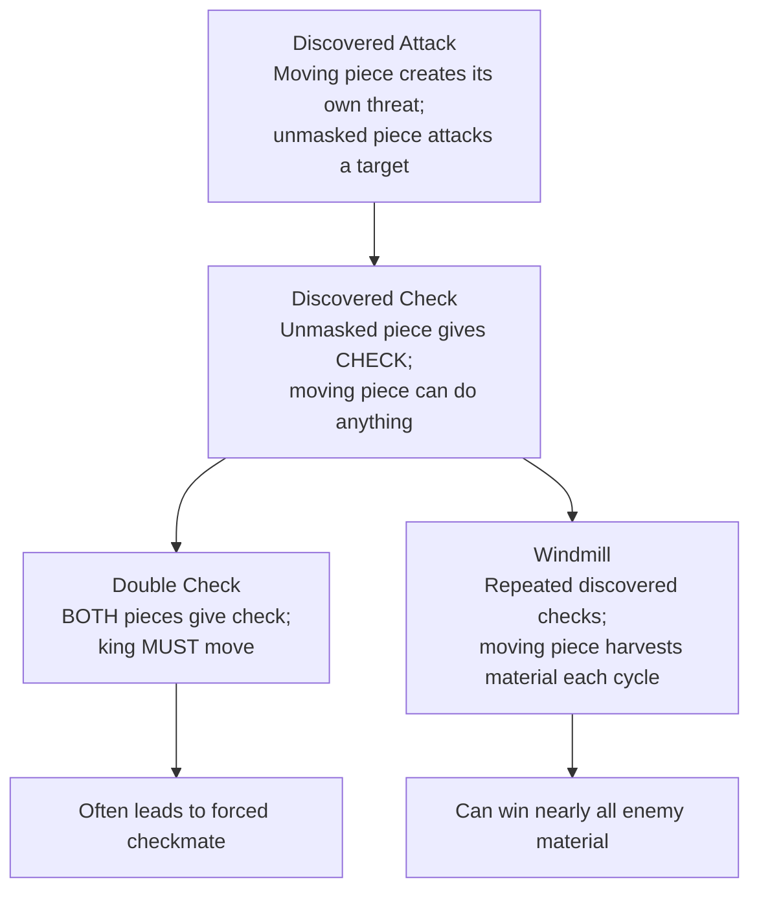
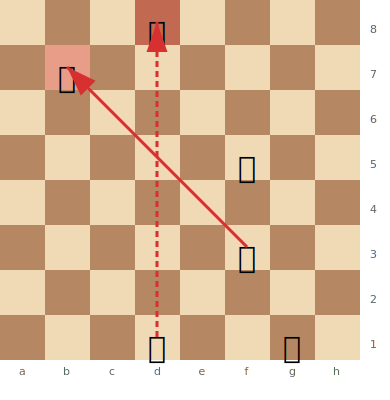

# Discovered Attacks & Discovered Checks

A **discovered attack** occurs when a piece moves out of the way of another piece, "unmasking" an attack from the piece behind it. When the unmasked attack is a check, it's called a **discovered check** — one of the most powerful tactical devices in chess.

**See also:** [Double Checks](double-checks.md) | [Pins](pins.md) | [Skewers](skewers.md)

---

## How Discovered Attacks Work

```
Setup: White Bc1, White Nd4, Black Qg5.
If White moves Nd4 elsewhere, the Bc1 is "discovered" — it now attacks the Qg5.
```

The key: the moving piece can go anywhere — including making its own threat. This means you get **two threats at once**: the discovered attack plus whatever the moving piece does.

### Escalation Hierarchy

Discovered attacks form a hierarchy of increasing power:



---

## Discovered Check

When the unmasked piece gives check, the opponent **must** deal with the check. Meanwhile, the moving piece can capture anything — even the queen — because the opponent has no choice but to address the check first.



> **FEN:** `3k4/1p6/8/5q2/8/5B2/8/3R2K1 w - - 0 1`

---

## The Windmill

A **windmill** (or "see-saw") is a repeated sequence of discovered checks. The moving piece captures a new target each time, then returns to the blocking square for the next discovered check.

### Famous Example: Torre vs Adams, 1920

```
White had a bishop on g5 and a rook on the 7th rank.
The bishop moved away giving a discovered check, captured material,
then returned to g5, and the sequence repeated — winning nearly all of Black's pieces.
```

See also: [Famous Games — The Immortal Game](../famous-games/immortal-game.md) for spectacular discovered attacks.

---

## Setting Up Discovered Attacks

1. **Align your pieces:** Place a long-range piece behind another piece on the same line as an enemy target
2. **Look for the moving piece's threats:** The power is in the double threat
3. **Use forced moves:** The discovered attack is strongest when the moving piece also gives check or captures

---

## Defending Against Discovered Attacks

1. **Avoid aligning king/queen with opponent's long-range pieces**
2. **Block the discovery line** if possible
3. **Move the target** before the discovery happens
4. **Counter-threat:** If your own threat is bigger, the opponent may not benefit from the discovery

---

**Next:** [Double Checks](double-checks.md) | **Back to:** [Tactics Index](index.md)
