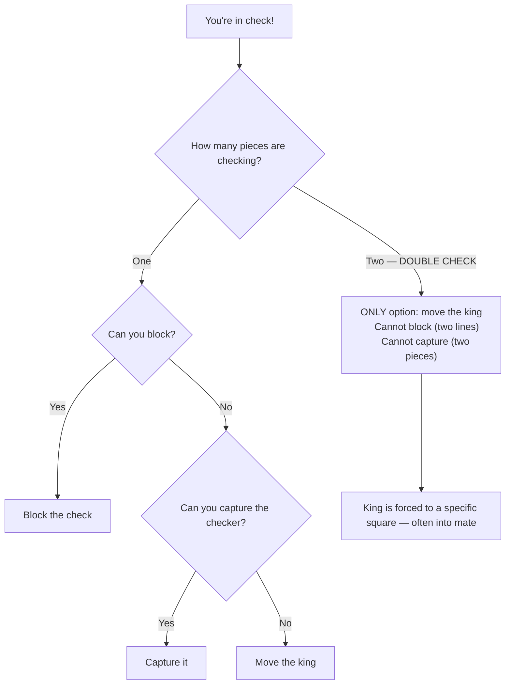
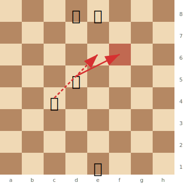

# Double Checks

A **double check** is a special type of [discovered check](discovered-attacks.md) where **both** the moving piece and the unmasked piece give check simultaneously. It is the most forcing move type in chess.

**See also:** [Discovered Attacks](discovered-attacks.md) | [Mating Patterns](mating-patterns.md)

---

## Why Double Checks Are So Powerful

In a double check, the opponent **can only move the king**. They cannot:
- Block the check (two pieces are checking — you can't block both)
- Capture the checking piece (there are two of them)

The king **must** move. This makes double checks extremely powerful — they can force the king into positions where checkmate follows.

---

## Example

> **FEN:** `3qk3/8/8/3N4/2B5/8/8/4K3 w - - 0 1`

---

## Double Check Patterns

1. **Knight + Bishop:** The knight moves to give check while unmasking a bishop check. Common in tactical combinations.
2. **Knight + Rook:** The knight moves to check while opening a rook's line.
3. **Bishop + Rook:** The bishop moves to check while opening a rook's file.

## Connection to Smothered Mate

The famous [smothered mate](mating-patterns.md) pattern often features a double check as part of the sequence — the knight delivers a double check, forcing the king to a corner, where a follow-up knight check delivers mate.

---

## Practical Advice

- Double checks are rare but devastating — always look for them when your pieces are aligned
- They often appear as the climax of a [discovered attack](discovered-attacks.md) combination
- Since only the king can move, calculate where the king must go — it might walk into mate

---

**Next:** [Deflection & Decoy](deflection-decoy.md) | **Back to:** [Tactics Index](index.md)
