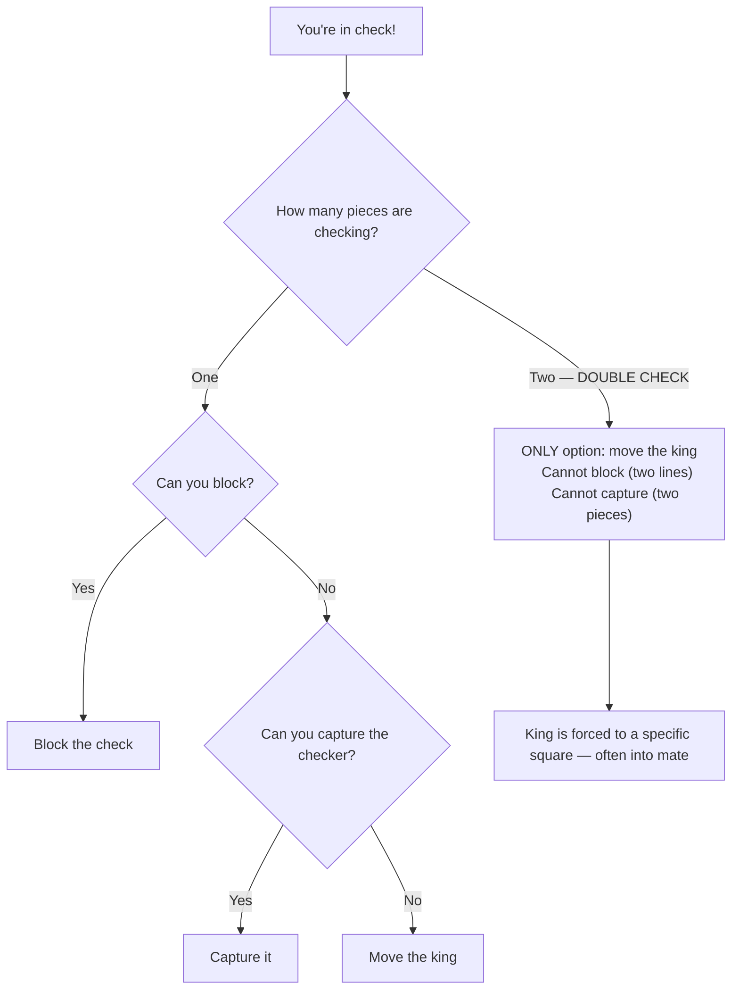

# Double Checks

A **double check** is a special type of [discovered check](discovered-attacks.md) where **both** the moving piece and the unmasked piece give check simultaneously. It is the most forcing move type in chess.

**See also:** [Discovered Attacks](discovered-attacks.md) | [Mating Patterns](mating-patterns.md)

---

## Why Double Checks Are So Powerful

In a double check, the opponent **can only move the king**. They cannot:
- Block the check (two pieces are checking — you can't block both)
- Capture the checking piece (there are two of them)

The king **must** move. This makes double checks extremely powerful — they can force the king into positions where checkmate follows.

---

## Example

<svg viewBox="0 0 390 400" xmlns="http://www.w3.org/2000/svg" style="max-width:400px">
  <rect x="0" y="0" width="360" height="360" fill="#b58863"/>
  <rect x="0" y="0" width="45" height="45" fill="#f0d9b5"/><rect x="90" y="0" width="45" height="45" fill="#f0d9b5"/><rect x="180" y="0" width="45" height="45" fill="#f0d9b5"/><rect x="270" y="0" width="45" height="45" fill="#f0d9b5"/>
  <rect x="45" y="45" width="45" height="45" fill="#f0d9b5"/><rect x="135" y="45" width="45" height="45" fill="#f0d9b5"/><rect x="225" y="45" width="45" height="45" fill="#f0d9b5"/><rect x="315" y="45" width="45" height="45" fill="#f0d9b5"/>
  <rect x="0" y="90" width="45" height="45" fill="#f0d9b5"/><rect x="90" y="90" width="45" height="45" fill="#f0d9b5"/><rect x="180" y="90" width="45" height="45" fill="#f0d9b5"/><rect x="270" y="90" width="45" height="45" fill="#f0d9b5"/>
  <rect x="45" y="135" width="45" height="45" fill="#f0d9b5"/><rect x="135" y="135" width="45" height="45" fill="#f0d9b5"/><rect x="225" y="135" width="45" height="45" fill="#f0d9b5"/><rect x="315" y="135" width="45" height="45" fill="#f0d9b5"/>
  <rect x="0" y="180" width="45" height="45" fill="#f0d9b5"/><rect x="90" y="180" width="45" height="45" fill="#f0d9b5"/><rect x="180" y="180" width="45" height="45" fill="#f0d9b5"/><rect x="270" y="180" width="45" height="45" fill="#f0d9b5"/>
  <rect x="45" y="225" width="45" height="45" fill="#f0d9b5"/><rect x="135" y="225" width="45" height="45" fill="#f0d9b5"/><rect x="225" y="225" width="45" height="45" fill="#f0d9b5"/><rect x="315" y="225" width="45" height="45" fill="#f0d9b5"/>
  <rect x="0" y="270" width="45" height="45" fill="#f0d9b5"/><rect x="90" y="270" width="45" height="45" fill="#f0d9b5"/><rect x="180" y="270" width="45" height="45" fill="#f0d9b5"/><rect x="270" y="270" width="45" height="45" fill="#f0d9b5"/>
  <rect x="45" y="315" width="45" height="45" fill="#f0d9b5"/><rect x="135" y="315" width="45" height="45" fill="#f0d9b5"/><rect x="225" y="315" width="45" height="45" fill="#f0d9b5"/><rect x="315" y="315" width="45" height="45" fill="#f0d9b5"/>
  <rect x="225" y="90" width="45" height="45" fill="#d63031" opacity="0.35"/>
  <defs><marker id="ah" markerWidth="10" markerHeight="7" refX="10" refY="3.5" orient="auto"><polygon points="0 0,10 3.5,0 7" fill="#d63031"/></marker></defs>
  <text x="157" y="33" font-size="30" text-anchor="middle" dominant-baseline="central" font-family="serif">♛</text>
  <text x="202" y="33" font-size="30" text-anchor="middle" dominant-baseline="central" font-family="serif">♚</text>
  <text x="157" y="168" font-size="30" text-anchor="middle" dominant-baseline="central" font-family="serif">♘</text>
  <text x="112" y="213" font-size="30" text-anchor="middle" dominant-baseline="central" font-family="serif">♗</text>
  <text x="202" y="348" font-size="30" text-anchor="middle" dominant-baseline="central" font-family="serif">♔</text>
  <line x1="157" y1="157" x2="247" y2="112" stroke="#d63031" stroke-width="3" marker-end="url(#ah)"/>
  <line x1="112" y1="202" x2="202" y2="112" stroke="#d63031" stroke-width="3" marker-end="url(#ah)" stroke-dasharray="6,4"/>
  <text x="22" y="375" font-size="11" fill="#666" text-anchor="middle" font-family="sans-serif">a</text>
  <text x="67" y="375" font-size="11" fill="#666" text-anchor="middle" font-family="sans-serif">b</text>
  <text x="112" y="375" font-size="11" fill="#666" text-anchor="middle" font-family="sans-serif">c</text>
  <text x="157" y="375" font-size="11" fill="#666" text-anchor="middle" font-family="sans-serif">d</text>
  <text x="202" y="375" font-size="11" fill="#666" text-anchor="middle" font-family="sans-serif">e</text>
  <text x="247" y="375" font-size="11" fill="#666" text-anchor="middle" font-family="sans-serif">f</text>
  <text x="292" y="375" font-size="11" fill="#666" text-anchor="middle" font-family="sans-serif">g</text>
  <text x="337" y="375" font-size="11" fill="#666" text-anchor="middle" font-family="sans-serif">h</text>
  <text x="370" y="33" font-size="11" fill="#666" font-family="sans-serif">8</text>
  <text x="370" y="78" font-size="11" fill="#666" font-family="sans-serif">7</text>
  <text x="370" y="123" font-size="11" fill="#666" font-family="sans-serif">6</text>
  <text x="370" y="168" font-size="11" fill="#666" font-family="sans-serif">5</text>
  <text x="370" y="213" font-size="11" fill="#666" font-family="sans-serif">4</text>
  <text x="370" y="258" font-size="11" fill="#666" font-family="sans-serif">3</text>
  <text x="370" y="303" font-size="11" fill="#666" font-family="sans-serif">2</text>
  <text x="370" y="348" font-size="11" fill="#666" font-family="sans-serif">1</text>
</svg>

> **FEN:** `3qk3/8/8/3N4/2B5/8/8/4K3 w - - 0 1`

---

## Double Check Patterns

1. **Knight + Bishop:** The knight moves to give check while unmasking a bishop check. Common in tactical combinations.
2. **Knight + Rook:** The knight moves to check while opening a rook's line.
3. **Bishop + Rook:** The bishop moves to check while opening a rook's file.

## Connection to Smothered Mate

The famous [smothered mate](mating-patterns.md) pattern often features a double check as part of the sequence — the knight delivers a double check, forcing the king to a corner, where a follow-up knight check delivers mate.

---

## Practical Advice

- Double checks are rare but devastating — always look for them when your pieces are aligned
- They often appear as the climax of a [discovered attack](discovered-attacks.md) combination
- Since only the king can move, calculate where the king must go — it might walk into mate

---

**Next:** [Deflection & Decoy](deflection-decoy.md) | **Back to:** [Tactics Index](index.md)
