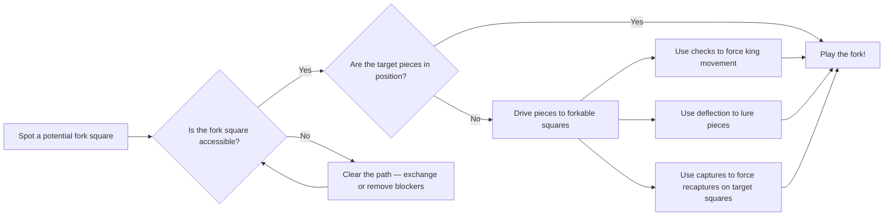

# Forks (Double Attacks)

A **fork** is a tactic where a single piece attacks two or more enemy pieces simultaneously. The opponent can only save one, so you win material.

**See also:** [Pins](pins.md) | [Skewers](skewers.md) | [Discovered Attacks](discovered-attacks.md)

---

## Types of Forks

### Knight Forks

The most devastating type — knights attack in an L-shape, making their forks hard to see and defend.

**The Royal Fork:** A knight simultaneously attacks the king and queen. Almost always wins the queen.

<svg viewBox="0 0 390 400" xmlns="http://www.w3.org/2000/svg" style="max-width:400px">
  <rect x="0" y="0" width="360" height="360" fill="#b58863"/>
  <rect x="0" y="0" width="45" height="45" fill="#f0d9b5"/><rect x="90" y="0" width="45" height="45" fill="#f0d9b5"/><rect x="180" y="0" width="45" height="45" fill="#f0d9b5"/><rect x="270" y="0" width="45" height="45" fill="#f0d9b5"/>
  <rect x="45" y="45" width="45" height="45" fill="#f0d9b5"/><rect x="135" y="45" width="45" height="45" fill="#f0d9b5"/><rect x="225" y="45" width="45" height="45" fill="#f0d9b5"/><rect x="315" y="45" width="45" height="45" fill="#f0d9b5"/>
  <rect x="0" y="90" width="45" height="45" fill="#f0d9b5"/><rect x="90" y="90" width="45" height="45" fill="#f0d9b5"/><rect x="180" y="90" width="45" height="45" fill="#f0d9b5"/><rect x="270" y="90" width="45" height="45" fill="#f0d9b5"/>
  <rect x="45" y="135" width="45" height="45" fill="#f0d9b5"/><rect x="135" y="135" width="45" height="45" fill="#f0d9b5"/><rect x="225" y="135" width="45" height="45" fill="#f0d9b5"/><rect x="315" y="135" width="45" height="45" fill="#f0d9b5"/>
  <rect x="0" y="180" width="45" height="45" fill="#f0d9b5"/><rect x="90" y="180" width="45" height="45" fill="#f0d9b5"/><rect x="180" y="180" width="45" height="45" fill="#f0d9b5"/><rect x="270" y="180" width="45" height="45" fill="#f0d9b5"/>
  <rect x="45" y="225" width="45" height="45" fill="#f0d9b5"/><rect x="135" y="225" width="45" height="45" fill="#f0d9b5"/><rect x="225" y="225" width="45" height="45" fill="#f0d9b5"/><rect x="315" y="225" width="45" height="45" fill="#f0d9b5"/>
  <rect x="0" y="270" width="45" height="45" fill="#f0d9b5"/><rect x="90" y="270" width="45" height="45" fill="#f0d9b5"/><rect x="180" y="270" width="45" height="45" fill="#f0d9b5"/><rect x="270" y="270" width="45" height="45" fill="#f0d9b5"/>
  <rect x="45" y="315" width="45" height="45" fill="#f0d9b5"/><rect x="135" y="315" width="45" height="45" fill="#f0d9b5"/><rect x="225" y="315" width="45" height="45" fill="#f0d9b5"/><rect x="315" y="315" width="45" height="45" fill="#f0d9b5"/>
  <rect x="90" y="45" width="45" height="45" fill="#d63031" opacity="0.35"/>
  <defs><marker id="ah" markerWidth="10" markerHeight="7" refX="10" refY="3.5" orient="auto"><polygon points="0 0,10 3.5,0 7" fill="#d63031"/></marker></defs>
  <text x="22" y="33" font-size="30" text-anchor="middle" dominant-baseline="central" font-family="serif">♜</text>
  <text x="202" y="33" font-size="30" text-anchor="middle" dominant-baseline="central" font-family="serif">♚</text>
  <text x="112" y="78" font-size="30" text-anchor="middle" dominant-baseline="central" font-family="serif">♘</text>
  <text x="202" y="348" font-size="30" text-anchor="middle" dominant-baseline="central" font-family="serif">♔</text>
  <line x1="112" y1="67" x2="202" y2="22" stroke="#d63031" stroke-width="3" marker-end="url(#ah)"/>
  <line x1="112" y1="67" x2="22" y2="22" stroke="#d63031" stroke-width="3" marker-end="url(#ah)"/>
  <text x="22" y="375" font-size="11" fill="#666" text-anchor="middle" font-family="sans-serif">a</text>
  <text x="67" y="375" font-size="11" fill="#666" text-anchor="middle" font-family="sans-serif">b</text>
  <text x="112" y="375" font-size="11" fill="#666" text-anchor="middle" font-family="sans-serif">c</text>
  <text x="157" y="375" font-size="11" fill="#666" text-anchor="middle" font-family="sans-serif">d</text>
  <text x="202" y="375" font-size="11" fill="#666" text-anchor="middle" font-family="sans-serif">e</text>
  <text x="247" y="375" font-size="11" fill="#666" text-anchor="middle" font-family="sans-serif">f</text>
  <text x="292" y="375" font-size="11" fill="#666" text-anchor="middle" font-family="sans-serif">g</text>
  <text x="337" y="375" font-size="11" fill="#666" text-anchor="middle" font-family="sans-serif">h</text>
  <text x="370" y="33" font-size="11" fill="#666" font-family="sans-serif">8</text>
  <text x="370" y="78" font-size="11" fill="#666" font-family="sans-serif">7</text>
  <text x="370" y="123" font-size="11" fill="#666" font-family="sans-serif">6</text>
  <text x="370" y="168" font-size="11" fill="#666" font-family="sans-serif">5</text>
  <text x="370" y="213" font-size="11" fill="#666" font-family="sans-serif">4</text>
  <text x="370" y="258" font-size="11" fill="#666" font-family="sans-serif">3</text>
  <text x="370" y="303" font-size="11" fill="#666" font-family="sans-serif">2</text>
  <text x="370" y="348" font-size="11" fill="#666" font-family="sans-serif">1</text>
</svg>

> **FEN:** `r3k3/2N5/8/8/8/8/8/4K3 w - - 0 1`

**The Family Fork:** A knight attacks king, queen, AND rook simultaneously.

### Pawn Forks

Pawns can fork two pieces by advancing diagonally. Especially dangerous because the pawn is the least valuable piece.

<svg viewBox="0 0 390 400" xmlns="http://www.w3.org/2000/svg" style="max-width:400px">
  <rect x="0" y="0" width="360" height="360" fill="#b58863"/>
  <rect x="0" y="0" width="45" height="45" fill="#f0d9b5"/><rect x="90" y="0" width="45" height="45" fill="#f0d9b5"/><rect x="180" y="0" width="45" height="45" fill="#f0d9b5"/><rect x="270" y="0" width="45" height="45" fill="#f0d9b5"/>
  <rect x="45" y="45" width="45" height="45" fill="#f0d9b5"/><rect x="135" y="45" width="45" height="45" fill="#f0d9b5"/><rect x="225" y="45" width="45" height="45" fill="#f0d9b5"/><rect x="315" y="45" width="45" height="45" fill="#f0d9b5"/>
  <rect x="0" y="90" width="45" height="45" fill="#f0d9b5"/><rect x="90" y="90" width="45" height="45" fill="#f0d9b5"/><rect x="180" y="90" width="45" height="45" fill="#f0d9b5"/><rect x="270" y="90" width="45" height="45" fill="#f0d9b5"/>
  <rect x="45" y="135" width="45" height="45" fill="#f0d9b5"/><rect x="135" y="135" width="45" height="45" fill="#f0d9b5"/><rect x="225" y="135" width="45" height="45" fill="#f0d9b5"/><rect x="315" y="135" width="45" height="45" fill="#f0d9b5"/>
  <rect x="0" y="180" width="45" height="45" fill="#f0d9b5"/><rect x="90" y="180" width="45" height="45" fill="#f0d9b5"/><rect x="180" y="180" width="45" height="45" fill="#f0d9b5"/><rect x="270" y="180" width="45" height="45" fill="#f0d9b5"/>
  <rect x="45" y="225" width="45" height="45" fill="#f0d9b5"/><rect x="135" y="225" width="45" height="45" fill="#f0d9b5"/><rect x="225" y="225" width="45" height="45" fill="#f0d9b5"/><rect x="315" y="225" width="45" height="45" fill="#f0d9b5"/>
  <rect x="0" y="270" width="45" height="45" fill="#f0d9b5"/><rect x="90" y="270" width="45" height="45" fill="#f0d9b5"/><rect x="180" y="270" width="45" height="45" fill="#f0d9b5"/><rect x="270" y="270" width="45" height="45" fill="#f0d9b5"/>
  <rect x="45" y="315" width="45" height="45" fill="#f0d9b5"/><rect x="135" y="315" width="45" height="45" fill="#f0d9b5"/><rect x="225" y="315" width="45" height="45" fill="#f0d9b5"/><rect x="315" y="315" width="45" height="45" fill="#f0d9b5"/>
  <rect x="180" y="135" width="45" height="45" fill="#d63031" opacity="0.35"/>
  <defs><marker id="ah" markerWidth="10" markerHeight="7" refX="10" refY="3.5" orient="auto"><polygon points="0 0,10 3.5,0 7" fill="#d63031"/></marker></defs>
  <text x="292" y="33" font-size="30" text-anchor="middle" dominant-baseline="central" font-family="serif">♚</text>
  <text x="157" y="123" font-size="30" text-anchor="middle" dominant-baseline="central" font-family="serif">♝</text>
  <text x="247" y="123" font-size="30" text-anchor="middle" dominant-baseline="central" font-family="serif">♞</text>
  <text x="202" y="213" font-size="30" text-anchor="middle" dominant-baseline="central" font-family="serif">♙</text>
  <text x="202" y="348" font-size="30" text-anchor="middle" dominant-baseline="central" font-family="serif">♔</text>
  <line x1="202" y1="202" x2="202" y2="157" stroke="#d63031" stroke-width="3" marker-end="url(#ah)"/>
  <text x="22" y="375" font-size="11" fill="#666" text-anchor="middle" font-family="sans-serif">a</text>
  <text x="67" y="375" font-size="11" fill="#666" text-anchor="middle" font-family="sans-serif">b</text>
  <text x="112" y="375" font-size="11" fill="#666" text-anchor="middle" font-family="sans-serif">c</text>
  <text x="157" y="375" font-size="11" fill="#666" text-anchor="middle" font-family="sans-serif">d</text>
  <text x="202" y="375" font-size="11" fill="#666" text-anchor="middle" font-family="sans-serif">e</text>
  <text x="247" y="375" font-size="11" fill="#666" text-anchor="middle" font-family="sans-serif">f</text>
  <text x="292" y="375" font-size="11" fill="#666" text-anchor="middle" font-family="sans-serif">g</text>
  <text x="337" y="375" font-size="11" fill="#666" text-anchor="middle" font-family="sans-serif">h</text>
  <text x="370" y="33" font-size="11" fill="#666" font-family="sans-serif">8</text>
  <text x="370" y="78" font-size="11" fill="#666" font-family="sans-serif">7</text>
  <text x="370" y="123" font-size="11" fill="#666" font-family="sans-serif">6</text>
  <text x="370" y="168" font-size="11" fill="#666" font-family="sans-serif">5</text>
  <text x="370" y="213" font-size="11" fill="#666" font-family="sans-serif">4</text>
  <text x="370" y="258" font-size="11" fill="#666" font-family="sans-serif">3</text>
  <text x="370" y="303" font-size="11" fill="#666" font-family="sans-serif">2</text>
  <text x="370" y="348" font-size="11" fill="#666" font-family="sans-serif">1</text>
</svg>

> **FEN:** `6k1/8/3b1n2/8/4P3/8/8/4K3 w - - 0 1`

### Queen Forks

The queen can fork along ranks, files, and diagonals — in every direction. She's the best forking piece by range, though her high value means she must be careful not to be captured.

### Bishop Forks

Bishops fork along diagonals. Less common than knight forks but can be just as effective.

### Rook Forks

Rooks can fork along ranks and files, though this is less common since rooks are usually deployed on open files rather than attacking multiple targets.

---

## Setting Up Forks

Forks rarely appear by accident. You create them by:

1. **Forcing moves:** Use checks, captures, or threats to drive pieces to forkable squares
2. **Exchanges:** Trade off defenders that prevent the fork
3. **Deflection:** Lure a piece to a vulnerable square — see [Deflection & Decoy](deflection-decoy.md)
4. **Removing the defender:** Eliminate the piece guarding the fork square — see [Removing the Defender](removing-the-defender.md)

---

## Defending Against Forks

1. **Avoid placing pieces on the same colour complex** where a knight can reach both
2. **Keep the king protected** — an exposed king invites royal forks
3. **Watch for pawn advances** that create fork threats
4. **When both pieces are attacked:** save the more valuable one, or find a counter-threat (see [Zwischenzug](zwischenzug.md))

---

## Practical Advice

- **Knight forks are the #1 tactic beginners miss.** Always ask: "Can a knight land on a square that attacks two of my pieces?"
- Forks are often the culmination of a longer tactical sequence — a [pin](pins.md) or [discovered attack](discovered-attacks.md) might set up the fork

---

**Next:** [Skewers](skewers.md) | **Back to:** [Tactics Index](index.md)
