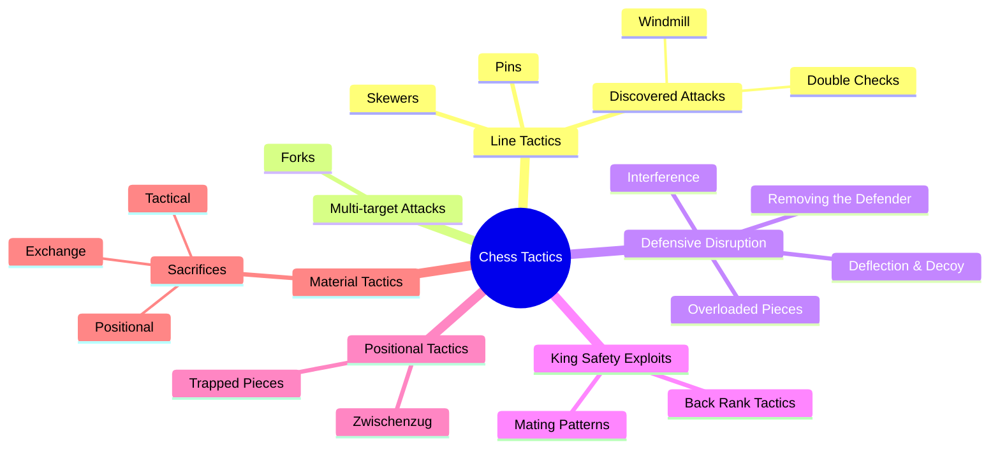

# Chess Tactics

Tactics are the lifeblood of chess — short sequences of moves that exploit specific features of a position to gain material, deliver checkmate, or gain a decisive advantage. Studying tactics builds pattern recognition, the most important skill for improvement.

## How Tactics Relate to Each Other

## Tactical Motifs

- [Pins](pins.md) — absolute and relative pins
- [Forks](forks.md) — double attacks by a single piece
- [Skewers](skewers.md) — reverse pins (attacking through a piece)
- [Discovered Attacks](discovered-attacks.md) — unmasking a hidden attacker
- [Double Checks](double-checks.md) — the most powerful type of check
- [Deflection & Decoy](deflection-decoy.md) — luring defenders away
- [Overloaded Pieces](overloaded-pieces.md) — exploiting pieces with too many jobs
- [Removing the Defender](removing-the-defender.md) — eliminating key protectors
- [Interference](interference.md) — cutting lines of communication
- [Zwischenzug](zwischenzug.md) — the "in-between" move
- [Back Rank Tactics](back-rank.md) — exploiting the unprotected back rank
- [Trapped Pieces](trapped-pieces.md) — pieces with no escape
- [Sacrifices](sacrifices.md) — giving up material for greater gains

## Mating Patterns

- [Mating Patterns](mating-patterns.md) — all the classic checkmate patterns

## Attacking Themes

- [Attacking the Castled King](../middlegame/attacking-the-king.md) — Greek Gift, pawn storms, piece sacrifices

---

**Study tip:** Solve tactical puzzles daily. Start with simple 1–2 move combinations and gradually increase difficulty. Pattern recognition is built through repetition. See [Fundamentals — How to Study](../fundamentals/how-to-study.md).
