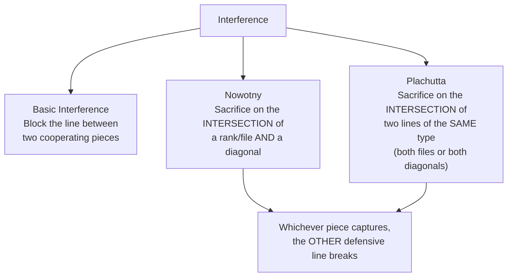

# Interference

**Interference** is a tactic where you place a piece on a square that interrupts the communication between two enemy pieces — cutting their line of defence or coordination.

**See also:** [Overloaded Pieces](overloaded-pieces.md) | [Deflection & Decoy](deflection-decoy.md) | [Removing the Defender](removing-the-defender.md)

---

## How It Works

Two enemy pieces protect each other or coordinate along a line (rank, file, or diagonal). You place a piece **between** them, breaking the connection. Now neither can help the other.

---

## Example

**White to play: Be5! interferes between the black rooks on the e-file:**

<svg viewBox="0 0 390 400" xmlns="http://www.w3.org/2000/svg" style="max-width:400px">
  <rect x="0" y="0" width="360" height="360" fill="#b58863"/>
  <rect x="0" y="0" width="45" height="45" fill="#f0d9b5"/><rect x="90" y="0" width="45" height="45" fill="#f0d9b5"/><rect x="180" y="0" width="45" height="45" fill="#f0d9b5"/><rect x="270" y="0" width="45" height="45" fill="#f0d9b5"/>
  <rect x="45" y="45" width="45" height="45" fill="#f0d9b5"/><rect x="135" y="45" width="45" height="45" fill="#f0d9b5"/><rect x="225" y="45" width="45" height="45" fill="#f0d9b5"/><rect x="315" y="45" width="45" height="45" fill="#f0d9b5"/>
  <rect x="0" y="90" width="45" height="45" fill="#f0d9b5"/><rect x="90" y="90" width="45" height="45" fill="#f0d9b5"/><rect x="180" y="90" width="45" height="45" fill="#f0d9b5"/><rect x="270" y="90" width="45" height="45" fill="#f0d9b5"/>
  <rect x="45" y="135" width="45" height="45" fill="#f0d9b5"/><rect x="135" y="135" width="45" height="45" fill="#f0d9b5"/><rect x="225" y="135" width="45" height="45" fill="#f0d9b5"/><rect x="315" y="135" width="45" height="45" fill="#f0d9b5"/>
  <rect x="0" y="180" width="45" height="45" fill="#f0d9b5"/><rect x="90" y="180" width="45" height="45" fill="#f0d9b5"/><rect x="180" y="180" width="45" height="45" fill="#f0d9b5"/><rect x="270" y="180" width="45" height="45" fill="#f0d9b5"/>
  <rect x="45" y="225" width="45" height="45" fill="#f0d9b5"/><rect x="135" y="225" width="45" height="45" fill="#f0d9b5"/><rect x="225" y="225" width="45" height="45" fill="#f0d9b5"/><rect x="315" y="225" width="45" height="45" fill="#f0d9b5"/>
  <rect x="0" y="270" width="45" height="45" fill="#f0d9b5"/><rect x="90" y="270" width="45" height="45" fill="#f0d9b5"/><rect x="180" y="270" width="45" height="45" fill="#f0d9b5"/><rect x="270" y="270" width="45" height="45" fill="#f0d9b5"/>
  <rect x="45" y="315" width="45" height="45" fill="#f0d9b5"/><rect x="135" y="315" width="45" height="45" fill="#f0d9b5"/><rect x="225" y="315" width="45" height="45" fill="#f0d9b5"/><rect x="315" y="315" width="45" height="45" fill="#f0d9b5"/>
  <rect x="180" y="135" width="45" height="45" fill="#d63031" opacity="0.35"/>
  <defs><marker id="ah" markerWidth="10" markerHeight="7" refX="10" refY="3.5" orient="auto"><polygon points="0 0,10 3.5,0 7" fill="#d63031"/></marker></defs>
  <text x="202" y="33" font-size="30" text-anchor="middle" dominant-baseline="central" font-family="serif">♜</text>
  <text x="292" y="33" font-size="30" text-anchor="middle" dominant-baseline="central" font-family="serif">♚</text>
  <text x="292" y="78" font-size="30" text-anchor="middle" dominant-baseline="central" font-family="serif">♟</text>
  <text x="337" y="78" font-size="30" text-anchor="middle" dominant-baseline="central" font-family="serif">♟</text>
  <text x="112" y="258" font-size="30" text-anchor="middle" dominant-baseline="central" font-family="serif">♗</text>
  <text x="202" y="303" font-size="30" text-anchor="middle" dominant-baseline="central" font-family="serif">♜</text>
  <text x="202" y="348" font-size="30" text-anchor="middle" dominant-baseline="central" font-family="serif">♖</text>
  <text x="292" y="348" font-size="30" text-anchor="middle" dominant-baseline="central" font-family="serif">♔</text>
  <line x1="112" y1="247" x2="202" y2="157" stroke="#d63031" stroke-width="3" marker-end="url(#ah)"/>
  <text x="22" y="375" font-size="11" fill="#666" text-anchor="middle" font-family="sans-serif">a</text>
  <text x="67" y="375" font-size="11" fill="#666" text-anchor="middle" font-family="sans-serif">b</text>
  <text x="112" y="375" font-size="11" fill="#666" text-anchor="middle" font-family="sans-serif">c</text>
  <text x="157" y="375" font-size="11" fill="#666" text-anchor="middle" font-family="sans-serif">d</text>
  <text x="202" y="375" font-size="11" fill="#666" text-anchor="middle" font-family="sans-serif">e</text>
  <text x="247" y="375" font-size="11" fill="#666" text-anchor="middle" font-family="sans-serif">f</text>
  <text x="292" y="375" font-size="11" fill="#666" text-anchor="middle" font-family="sans-serif">g</text>
  <text x="337" y="375" font-size="11" fill="#666" text-anchor="middle" font-family="sans-serif">h</text>
  <text x="370" y="33" font-size="11" fill="#666" font-family="sans-serif">8</text>
  <text x="370" y="78" font-size="11" fill="#666" font-family="sans-serif">7</text>
  <text x="370" y="123" font-size="11" fill="#666" font-family="sans-serif">6</text>
  <text x="370" y="168" font-size="11" fill="#666" font-family="sans-serif">5</text>
  <text x="370" y="213" font-size="11" fill="#666" font-family="sans-serif">4</text>
  <text x="370" y="258" font-size="11" fill="#666" font-family="sans-serif">3</text>
  <text x="370" y="303" font-size="11" fill="#666" font-family="sans-serif">2</text>
  <text x="370" y="348" font-size="11" fill="#666" font-family="sans-serif">1</text>
</svg>

> **FEN:** `4r1k1/6pp/8/8/8/2B5/4r3/4R1K1 w - - 0 1`

Black's Re2 and Re8 defend each other along the e-file. White plays Be5! (from c3, along the diagonal), placing the bishop between the two rooks on the e-file. Now if Re2xe5, White plays Re1xe8. If Re8xe5, White plays Re1xe2. The interference severs the rooks' mutual protection, and White wins the exchange.

---

### Interference Types



## Nowotny Interference

A Nowotny is a specific interference theme where a piece is sacrificed on the intersection of two enemy defensive lines (a rank/file and a diagonal). The sacrifice cuts both lines simultaneously.

```
Example: Black's rook defends along a file, and Black's bishop defends along a diagonal.
They intersect at e4. White sacrifices a piece on e4 — whichever Black piece captures,
the other defensive line is broken.
```

## Plachutta Interference

Similar to the Nowotny, but involves two pieces that move on the same type of line (both rooks on files, or both bishops on diagonals). A sacrifice at the intersection forces one to capture, cutting off the other.

---

## Practical Advice

- Interference is one of the rarer tactics but appears in complex combinations
- Look for it when two enemy pieces coordinate on intersecting lines
- Often appears in endgame studies and composed problems, but can occur in games
- The key question: "Can I cut the line between these two pieces?"

---

**Next:** [Zwischenzug](zwischenzug.md) | **Back to:** [Tactics Index](index.md)
