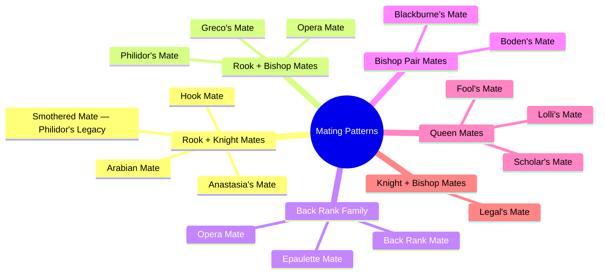

# Mating Patterns

Recognising checkmate patterns is a fundamental skill. These patterns recur throughout chess history — learning them allows you to spot winning combinations instantly.

**See also:** [Back Rank Tactics](back-rank.md) | [Sacrifices](sacrifices.md) | [Endgames — Basic Checkmates](../endgames/basic-checkmates.md)

---

## Back Rank Mate

A rook or queen delivers mate on the 1st/8th rank when the king is trapped by its own pawns. The most common mating pattern in practice. See [Back Rank Tactics](back-rank.md).

**Rd8# -- classic back rank mate:**

<svg viewBox="0 0 390 400" xmlns="http://www.w3.org/2000/svg" style="max-width:400px">
  <rect x="0" y="0" width="360" height="360" fill="#b58863"/>
  <rect x="0" y="0" width="45" height="45" fill="#f0d9b5"/><rect x="90" y="0" width="45" height="45" fill="#f0d9b5"/><rect x="180" y="0" width="45" height="45" fill="#f0d9b5"/><rect x="270" y="0" width="45" height="45" fill="#f0d9b5"/>
  <rect x="45" y="45" width="45" height="45" fill="#f0d9b5"/><rect x="135" y="45" width="45" height="45" fill="#f0d9b5"/><rect x="225" y="45" width="45" height="45" fill="#f0d9b5"/><rect x="315" y="45" width="45" height="45" fill="#f0d9b5"/>
  <rect x="0" y="90" width="45" height="45" fill="#f0d9b5"/><rect x="90" y="90" width="45" height="45" fill="#f0d9b5"/><rect x="180" y="90" width="45" height="45" fill="#f0d9b5"/><rect x="270" y="90" width="45" height="45" fill="#f0d9b5"/>
  <rect x="45" y="135" width="45" height="45" fill="#f0d9b5"/><rect x="135" y="135" width="45" height="45" fill="#f0d9b5"/><rect x="225" y="135" width="45" height="45" fill="#f0d9b5"/><rect x="315" y="135" width="45" height="45" fill="#f0d9b5"/>
  <rect x="0" y="180" width="45" height="45" fill="#f0d9b5"/><rect x="90" y="180" width="45" height="45" fill="#f0d9b5"/><rect x="180" y="180" width="45" height="45" fill="#f0d9b5"/><rect x="270" y="180" width="45" height="45" fill="#f0d9b5"/>
  <rect x="45" y="225" width="45" height="45" fill="#f0d9b5"/><rect x="135" y="225" width="45" height="45" fill="#f0d9b5"/><rect x="225" y="225" width="45" height="45" fill="#f0d9b5"/><rect x="315" y="225" width="45" height="45" fill="#f0d9b5"/>
  <rect x="0" y="270" width="45" height="45" fill="#f0d9b5"/><rect x="90" y="270" width="45" height="45" fill="#f0d9b5"/><rect x="180" y="270" width="45" height="45" fill="#f0d9b5"/><rect x="270" y="270" width="45" height="45" fill="#f0d9b5"/>
  <rect x="45" y="315" width="45" height="45" fill="#f0d9b5"/><rect x="135" y="315" width="45" height="45" fill="#f0d9b5"/><rect x="225" y="315" width="45" height="45" fill="#f0d9b5"/><rect x="315" y="315" width="45" height="45" fill="#f0d9b5"/>
  <rect x="135" y="0" width="45" height="45" fill="#d63031" opacity="0.35"/>
  <text x="157" y="33" font-size="30" text-anchor="middle" dominant-baseline="central" font-family="serif">♖</text>
  <text x="292" y="33" font-size="30" text-anchor="middle" dominant-baseline="central" font-family="serif">♚</text>
  <text x="247" y="78" font-size="30" text-anchor="middle" dominant-baseline="central" font-family="serif">♟</text>
  <text x="292" y="78" font-size="30" text-anchor="middle" dominant-baseline="central" font-family="serif">♟</text>
  <text x="337" y="78" font-size="30" text-anchor="middle" dominant-baseline="central" font-family="serif">♟</text>
  <text x="292" y="348" font-size="30" text-anchor="middle" dominant-baseline="central" font-family="serif">♔</text>
  <text x="22" y="375" font-size="11" fill="#666" text-anchor="middle" font-family="sans-serif">a</text>
  <text x="67" y="375" font-size="11" fill="#666" text-anchor="middle" font-family="sans-serif">b</text>
  <text x="112" y="375" font-size="11" fill="#666" text-anchor="middle" font-family="sans-serif">c</text>
  <text x="157" y="375" font-size="11" fill="#666" text-anchor="middle" font-family="sans-serif">d</text>
  <text x="202" y="375" font-size="11" fill="#666" text-anchor="middle" font-family="sans-serif">e</text>
  <text x="247" y="375" font-size="11" fill="#666" text-anchor="middle" font-family="sans-serif">f</text>
  <text x="292" y="375" font-size="11" fill="#666" text-anchor="middle" font-family="sans-serif">g</text>
  <text x="337" y="375" font-size="11" fill="#666" text-anchor="middle" font-family="sans-serif">h</text>
  <text x="370" y="33" font-size="11" fill="#666" font-family="sans-serif">8</text>
  <text x="370" y="78" font-size="11" fill="#666" font-family="sans-serif">7</text>
  <text x="370" y="123" font-size="11" fill="#666" font-family="sans-serif">6</text>
  <text x="370" y="168" font-size="11" fill="#666" font-family="sans-serif">5</text>
  <text x="370" y="213" font-size="11" fill="#666" font-family="sans-serif">4</text>
  <text x="370" y="258" font-size="11" fill="#666" font-family="sans-serif">3</text>
  <text x="370" y="303" font-size="11" fill="#666" font-family="sans-serif">2</text>
  <text x="370" y="348" font-size="11" fill="#666" font-family="sans-serif">1</text>
</svg>

> **FEN:** `3R2k1/5ppp/8/8/8/8/8/6K1 w - - 0 1`

The king is trapped by its own f7, g7, h7 pawns. The rook delivers mate on d8.

---

## Smothered Mate

A knight delivers mate when the king is completely surrounded by its own pieces.

### Philidor's Legacy (Classic Pattern)

**Nf7# -- smothered mate, the final position after Philidor's Legacy:**

<svg viewBox="0 0 390 400" xmlns="http://www.w3.org/2000/svg" style="max-width:400px">
  <rect x="0" y="0" width="360" height="360" fill="#b58863"/>
  <rect x="0" y="0" width="45" height="45" fill="#f0d9b5"/><rect x="90" y="0" width="45" height="45" fill="#f0d9b5"/><rect x="180" y="0" width="45" height="45" fill="#f0d9b5"/><rect x="270" y="0" width="45" height="45" fill="#f0d9b5"/>
  <rect x="45" y="45" width="45" height="45" fill="#f0d9b5"/><rect x="135" y="45" width="45" height="45" fill="#f0d9b5"/><rect x="225" y="45" width="45" height="45" fill="#f0d9b5"/><rect x="315" y="45" width="45" height="45" fill="#f0d9b5"/>
  <rect x="0" y="90" width="45" height="45" fill="#f0d9b5"/><rect x="90" y="90" width="45" height="45" fill="#f0d9b5"/><rect x="180" y="90" width="45" height="45" fill="#f0d9b5"/><rect x="270" y="90" width="45" height="45" fill="#f0d9b5"/>
  <rect x="45" y="135" width="45" height="45" fill="#f0d9b5"/><rect x="135" y="135" width="45" height="45" fill="#f0d9b5"/><rect x="225" y="135" width="45" height="45" fill="#f0d9b5"/><rect x="315" y="135" width="45" height="45" fill="#f0d9b5"/>
  <rect x="0" y="180" width="45" height="45" fill="#f0d9b5"/><rect x="90" y="180" width="45" height="45" fill="#f0d9b5"/><rect x="180" y="180" width="45" height="45" fill="#f0d9b5"/><rect x="270" y="180" width="45" height="45" fill="#f0d9b5"/>
  <rect x="45" y="225" width="45" height="45" fill="#f0d9b5"/><rect x="135" y="225" width="45" height="45" fill="#f0d9b5"/><rect x="225" y="225" width="45" height="45" fill="#f0d9b5"/><rect x="315" y="225" width="45" height="45" fill="#f0d9b5"/>
  <rect x="0" y="270" width="45" height="45" fill="#f0d9b5"/><rect x="90" y="270" width="45" height="45" fill="#f0d9b5"/><rect x="180" y="270" width="45" height="45" fill="#f0d9b5"/><rect x="270" y="270" width="45" height="45" fill="#f0d9b5"/>
  <rect x="45" y="315" width="45" height="45" fill="#f0d9b5"/><rect x="135" y="315" width="45" height="45" fill="#f0d9b5"/><rect x="225" y="315" width="45" height="45" fill="#f0d9b5"/><rect x="315" y="315" width="45" height="45" fill="#f0d9b5"/>
  <rect x="225" y="45" width="45" height="45" fill="#d63031" opacity="0.35"/>
  <text x="247" y="33" font-size="30" text-anchor="middle" dominant-baseline="central" font-family="serif">♜</text>
  <text x="292" y="33" font-size="30" text-anchor="middle" dominant-baseline="central" font-family="serif">♜</text>
  <text x="337" y="33" font-size="30" text-anchor="middle" dominant-baseline="central" font-family="serif">♚</text>
  <text x="247" y="78" font-size="30" text-anchor="middle" dominant-baseline="central" font-family="serif">♘</text>
  <text x="337" y="78" font-size="30" text-anchor="middle" dominant-baseline="central" font-family="serif">♟</text>
  <text x="292" y="348" font-size="30" text-anchor="middle" dominant-baseline="central" font-family="serif">♔</text>
  <text x="22" y="375" font-size="11" fill="#666" text-anchor="middle" font-family="sans-serif">a</text>
  <text x="67" y="375" font-size="11" fill="#666" text-anchor="middle" font-family="sans-serif">b</text>
  <text x="112" y="375" font-size="11" fill="#666" text-anchor="middle" font-family="sans-serif">c</text>
  <text x="157" y="375" font-size="11" fill="#666" text-anchor="middle" font-family="sans-serif">d</text>
  <text x="202" y="375" font-size="11" fill="#666" text-anchor="middle" font-family="sans-serif">e</text>
  <text x="247" y="375" font-size="11" fill="#666" text-anchor="middle" font-family="sans-serif">f</text>
  <text x="292" y="375" font-size="11" fill="#666" text-anchor="middle" font-family="sans-serif">g</text>
  <text x="337" y="375" font-size="11" fill="#666" text-anchor="middle" font-family="sans-serif">h</text>
  <text x="370" y="33" font-size="11" fill="#666" font-family="sans-serif">8</text>
  <text x="370" y="78" font-size="11" fill="#666" font-family="sans-serif">7</text>
  <text x="370" y="123" font-size="11" fill="#666" font-family="sans-serif">6</text>
  <text x="370" y="168" font-size="11" fill="#666" font-family="sans-serif">5</text>
  <text x="370" y="213" font-size="11" fill="#666" font-family="sans-serif">4</text>
  <text x="370" y="258" font-size="11" fill="#666" font-family="sans-serif">3</text>
  <text x="370" y="303" font-size="11" fill="#666" font-family="sans-serif">2</text>
  <text x="370" y="348" font-size="11" fill="#666" font-family="sans-serif">1</text>
</svg>

> **FEN:** `5rrk/5N1p/8/8/8/8/8/6K1 w - - 0 1`

The sequence: 1.Qf7+ Kh8 2.Qf8+! Rxf8 (forced queen sacrifice!) 3.Nf7# -- the king on h8 is smothered by its own rooks on f8 and g8 plus the pawn on h7. The knight on f7 delivers checkmate.

---

## Scholar's Mate

```
1.e4 e5 2.Qh5 Nc6 3.Bc4 Nf6?? 4.Qxf7#
```

The quickest common checkmate. White attacks f7 with the queen and bishop. Easily prevented (3...g6 or 3...Qe7), but catches many beginners.

---

## Fool's Mate

```
1.f3 e5 2.g4?? Qh4#
```

The fastest possible checkmate (2 moves). White weakens the king fatally with f3 and g4.

---

## Anastasia's Mate

A knight and rook deliver mate on the h-file with the king trapped by its own pawn.

**Rh8# -- Anastasia's mate with knight on e7:**

<svg viewBox="0 0 390 400" xmlns="http://www.w3.org/2000/svg" style="max-width:400px">
  <rect x="0" y="0" width="360" height="360" fill="#b58863"/>
  <rect x="0" y="0" width="45" height="45" fill="#f0d9b5"/><rect x="90" y="0" width="45" height="45" fill="#f0d9b5"/><rect x="180" y="0" width="45" height="45" fill="#f0d9b5"/><rect x="270" y="0" width="45" height="45" fill="#f0d9b5"/>
  <rect x="45" y="45" width="45" height="45" fill="#f0d9b5"/><rect x="135" y="45" width="45" height="45" fill="#f0d9b5"/><rect x="225" y="45" width="45" height="45" fill="#f0d9b5"/><rect x="315" y="45" width="45" height="45" fill="#f0d9b5"/>
  <rect x="0" y="90" width="45" height="45" fill="#f0d9b5"/><rect x="90" y="90" width="45" height="45" fill="#f0d9b5"/><rect x="180" y="90" width="45" height="45" fill="#f0d9b5"/><rect x="270" y="90" width="45" height="45" fill="#f0d9b5"/>
  <rect x="45" y="135" width="45" height="45" fill="#f0d9b5"/><rect x="135" y="135" width="45" height="45" fill="#f0d9b5"/><rect x="225" y="135" width="45" height="45" fill="#f0d9b5"/><rect x="315" y="135" width="45" height="45" fill="#f0d9b5"/>
  <rect x="0" y="180" width="45" height="45" fill="#f0d9b5"/><rect x="90" y="180" width="45" height="45" fill="#f0d9b5"/><rect x="180" y="180" width="45" height="45" fill="#f0d9b5"/><rect x="270" y="180" width="45" height="45" fill="#f0d9b5"/>
  <rect x="45" y="225" width="45" height="45" fill="#f0d9b5"/><rect x="135" y="225" width="45" height="45" fill="#f0d9b5"/><rect x="225" y="225" width="45" height="45" fill="#f0d9b5"/><rect x="315" y="225" width="45" height="45" fill="#f0d9b5"/>
  <rect x="0" y="270" width="45" height="45" fill="#f0d9b5"/><rect x="90" y="270" width="45" height="45" fill="#f0d9b5"/><rect x="180" y="270" width="45" height="45" fill="#f0d9b5"/><rect x="270" y="270" width="45" height="45" fill="#f0d9b5"/>
  <rect x="45" y="315" width="45" height="45" fill="#f0d9b5"/><rect x="135" y="315" width="45" height="45" fill="#f0d9b5"/><rect x="225" y="315" width="45" height="45" fill="#f0d9b5"/><rect x="315" y="315" width="45" height="45" fill="#f0d9b5"/>
  <rect x="315" y="0" width="45" height="45" fill="#d63031" opacity="0.35"/>
  <text x="337" y="33" font-size="30" text-anchor="middle" dominant-baseline="central" font-family="serif">♖</text>
  <text x="202" y="78" font-size="30" text-anchor="middle" dominant-baseline="central" font-family="serif">♘</text>
  <text x="292" y="78" font-size="30" text-anchor="middle" dominant-baseline="central" font-family="serif">♟</text>
  <text x="337" y="78" font-size="30" text-anchor="middle" dominant-baseline="central" font-family="serif">♚</text>
  <text x="292" y="348" font-size="30" text-anchor="middle" dominant-baseline="central" font-family="serif">♔</text>
  <text x="22" y="375" font-size="11" fill="#666" text-anchor="middle" font-family="sans-serif">a</text>
  <text x="67" y="375" font-size="11" fill="#666" text-anchor="middle" font-family="sans-serif">b</text>
  <text x="112" y="375" font-size="11" fill="#666" text-anchor="middle" font-family="sans-serif">c</text>
  <text x="157" y="375" font-size="11" fill="#666" text-anchor="middle" font-family="sans-serif">d</text>
  <text x="202" y="375" font-size="11" fill="#666" text-anchor="middle" font-family="sans-serif">e</text>
  <text x="247" y="375" font-size="11" fill="#666" text-anchor="middle" font-family="sans-serif">f</text>
  <text x="292" y="375" font-size="11" fill="#666" text-anchor="middle" font-family="sans-serif">g</text>
  <text x="337" y="375" font-size="11" fill="#666" text-anchor="middle" font-family="sans-serif">h</text>
  <text x="370" y="33" font-size="11" fill="#666" font-family="sans-serif">8</text>
  <text x="370" y="78" font-size="11" fill="#666" font-family="sans-serif">7</text>
  <text x="370" y="123" font-size="11" fill="#666" font-family="sans-serif">6</text>
  <text x="370" y="168" font-size="11" fill="#666" font-family="sans-serif">5</text>
  <text x="370" y="213" font-size="11" fill="#666" font-family="sans-serif">4</text>
  <text x="370" y="258" font-size="11" fill="#666" font-family="sans-serif">3</text>
  <text x="370" y="303" font-size="11" fill="#666" font-family="sans-serif">2</text>
  <text x="370" y="348" font-size="11" fill="#666" font-family="sans-serif">1</text>
</svg>

> **FEN:** `7R/4N1pk/8/8/8/8/8/6K1 w - - 0 1`

The knight on e7 controls g8 and g6. The pawn on g7 blocks that square. The rook delivers mate on h8. The king on h7 has no escape.

---

## Arabian Mate

A rook and knight cooperate — the knight covers escape squares while the rook delivers mate on the edge.

```
Rh8# with a knight on f7 covering g8 and e8 (the king is on g8 with no escape).
```

---

## Boden's Mate

Two bishops deliver mate on criss-crossing diagonals, typically after the king is on c1/c8 (or similar) with pawns blocking escape.

```
Classic pattern after O-O-O: ...Qa3+ Kb1 Ba2#
(or with two bishops crossing on a2-g8 and h1-a8 diagonals)
```

---

## Blackburne's Mate

A bishop, knight, and rook (or bishop) coordinate — the bishop on b7 (or similar) delivers mate aided by other pieces.

```
Typically: Bh7# with a knight covering key escape squares and the queen/rook controlling files.
```

---

## Epaulette Mate

The king is mated with pieces (usually its own rooks) on either side — like "epaulettes" on a military uniform.

```
Black: Kd8, Rc8, Re8 (rooks flanking the king).
White: Qd7# or Qd6# — the king can't move because its own rooks block the escape.
```

---

## Greco's Mate

A bishop and rook cooperate — the bishop controls the escape diagonal while the rook delivers mate on the h-file.

```
White: Rh8#, Bg7 (or bishop on the relevant diagonal controlling the king's escape).
```

---

## Hook Mate

A rook, knight, and pawn cooperate. The pawn restricts the king, the knight covers escape squares, and the rook delivers mate.

---

## Legal's Mate

A complete game illustrating the pattern:

```
1.e4 e5 2.Nf3 d6 3.Bc4 Bg4 4.Nc3 g6? 5.Nxe5! Bxd1??
6.Bxf7+ Ke7 7.Nd5#
```

White sacrifices the queen, and if Black captures it, a knight/bishop mating net closes in.

---

## Lolli's Mate

The queen, supported by a pawn, mates on g7 (or h7).

```
White: Qg7# with a pawn on f6 supporting and the king trapped on h8.
```

---

## Opera Mate

Named after [The Opera Game](../famous-games/opera-game.md). A rook delivers mate on the back rank, supported by a bishop on a diagonal, after the back-rank defender has been deflected.

```
The key: Qb8+! Nxb8, Rd8# — the bishop on c4 (or similar diagonal) supports the rook.
```

---

## Philidor's Mate

A bishop and rook cooperate — the bishop blocks the king's escape while the rook mates.

```
A rook delivers mate on the file or rank, with a bishop sealing off the escape diagonal.
```

---

## Pattern Families



## Summary Table

| Pattern | Key Pieces | Defining Feature |
|---------|-----------|-----------------|
| Back Rank | R/Q | King trapped by own pawns on 1st/8th rank |
| Smothered | N | King surrounded by own pieces; knight mates |
| Scholar's | Q + B | Quick Qxf7# in the opening |
| Fool's | Q | Fastest mate — 2 moves |
| Anastasia's | R + N | Knight covers escape; rook mates on h-file |
| Arabian | R + N | Edge-of-board mate with rook and knight |
| Boden's | B + B | Two bishops criss-cross |
| Epaulette | Q | King flanked by own pieces |
| Greco's | R + B | Bishop controls diagonal; rook mates on file |
| Legal's | N + B | Queen sacrifice into knight/bishop mate |
| Lolli's | Q + P | Queen mates on g7/h7 supported by pawn |
| Opera | R + B | Back rank mate after deflection |
| Smothered | N | Philidor's Legacy — Q sacrifice then N# |

---

**Back to:** [Tactics Index](index.md) | [Endgames — Basic Checkmates](../endgames/basic-checkmates.md)
