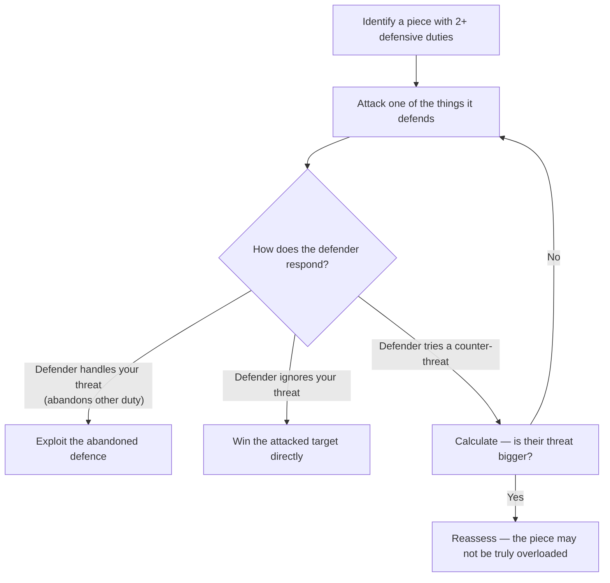

# Overloaded Pieces

A piece is **overloaded** (or **overworked**) when it has too many defensive responsibilities. It can't protect everything at once — exploit this by attacking one of its duties, forcing it to abandon another.

**See also:** [Deflection & Decoy](deflection-decoy.md) | [Removing the Defender](removing-the-defender.md) | [Back Rank Tactics](back-rank.md)

---

## How It Works

1. Identify a piece that is performing **two or more** defensive duties simultaneously
2. Attack one of the things it's defending
3. When it responds to your threat, the other duty is abandoned
4. Exploit the abandoned defence

---

## Example

<svg viewBox="0 0 390 400" xmlns="http://www.w3.org/2000/svg" style="max-width:400px">
  <rect x="0" y="0" width="360" height="360" fill="#b58863"/>
  <rect x="0" y="0" width="45" height="45" fill="#f0d9b5"/><rect x="90" y="0" width="45" height="45" fill="#f0d9b5"/><rect x="180" y="0" width="45" height="45" fill="#f0d9b5"/><rect x="270" y="0" width="45" height="45" fill="#f0d9b5"/>
  <rect x="45" y="45" width="45" height="45" fill="#f0d9b5"/><rect x="135" y="45" width="45" height="45" fill="#f0d9b5"/><rect x="225" y="45" width="45" height="45" fill="#f0d9b5"/><rect x="315" y="45" width="45" height="45" fill="#f0d9b5"/>
  <rect x="0" y="90" width="45" height="45" fill="#f0d9b5"/><rect x="90" y="90" width="45" height="45" fill="#f0d9b5"/><rect x="180" y="90" width="45" height="45" fill="#f0d9b5"/><rect x="270" y="90" width="45" height="45" fill="#f0d9b5"/>
  <rect x="45" y="135" width="45" height="45" fill="#f0d9b5"/><rect x="135" y="135" width="45" height="45" fill="#f0d9b5"/><rect x="225" y="135" width="45" height="45" fill="#f0d9b5"/><rect x="315" y="135" width="45" height="45" fill="#f0d9b5"/>
  <rect x="0" y="180" width="45" height="45" fill="#f0d9b5"/><rect x="90" y="180" width="45" height="45" fill="#f0d9b5"/><rect x="180" y="180" width="45" height="45" fill="#f0d9b5"/><rect x="270" y="180" width="45" height="45" fill="#f0d9b5"/>
  <rect x="45" y="225" width="45" height="45" fill="#f0d9b5"/><rect x="135" y="225" width="45" height="45" fill="#f0d9b5"/><rect x="225" y="225" width="45" height="45" fill="#f0d9b5"/><rect x="315" y="225" width="45" height="45" fill="#f0d9b5"/>
  <rect x="0" y="270" width="45" height="45" fill="#f0d9b5"/><rect x="90" y="270" width="45" height="45" fill="#f0d9b5"/><rect x="180" y="270" width="45" height="45" fill="#f0d9b5"/><rect x="270" y="270" width="45" height="45" fill="#f0d9b5"/>
  <rect x="45" y="315" width="45" height="45" fill="#f0d9b5"/><rect x="135" y="315" width="45" height="45" fill="#f0d9b5"/><rect x="225" y="315" width="45" height="45" fill="#f0d9b5"/><rect x="315" y="315" width="45" height="45" fill="#f0d9b5"/>
  <rect x="45" y="135" width="45" height="45" fill="#d63031" opacity="0.35"/>
  <rect x="135" y="0" width="45" height="45" fill="#d63031" opacity="0.35"/>
  <defs><marker id="ah" markerWidth="10" markerHeight="7" refX="10" refY="3.5" orient="auto"><polygon points="0 0,10 3.5,0 7" fill="#d63031"/></marker></defs>
  <text x="157" y="33" font-size="30" text-anchor="middle" dominant-baseline="central" font-family="serif">♜</text>
  <text x="292" y="33" font-size="30" text-anchor="middle" dominant-baseline="central" font-family="serif">♚</text>
  <text x="157" y="78" font-size="30" text-anchor="middle" dominant-baseline="central" font-family="serif">♛</text>
  <text x="292" y="78" font-size="30" text-anchor="middle" dominant-baseline="central" font-family="serif">♟</text>
  <text x="337" y="78" font-size="30" text-anchor="middle" dominant-baseline="central" font-family="serif">♟</text>
  <text x="67" y="168" font-size="30" text-anchor="middle" dominant-baseline="central" font-family="serif">♝</text>
  <text x="202" y="303" font-size="30" text-anchor="middle" dominant-baseline="central" font-family="serif">♕</text>
  <text x="157" y="348" font-size="30" text-anchor="middle" dominant-baseline="central" font-family="serif">♖</text>
  <text x="292" y="348" font-size="30" text-anchor="middle" dominant-baseline="central" font-family="serif">♔</text>
  <line x1="202" y1="292" x2="67" y2="157" stroke="#d63031" stroke-width="3" marker-end="url(#ah)"/>
  <line x1="157" y1="337" x2="157" y2="22" stroke="#d63031" stroke-width="3" marker-end="url(#ah)" stroke-dasharray="6,4"/>
  <text x="22" y="375" font-size="11" fill="#666" text-anchor="middle" font-family="sans-serif">a</text>
  <text x="67" y="375" font-size="11" fill="#666" text-anchor="middle" font-family="sans-serif">b</text>
  <text x="112" y="375" font-size="11" fill="#666" text-anchor="middle" font-family="sans-serif">c</text>
  <text x="157" y="375" font-size="11" fill="#666" text-anchor="middle" font-family="sans-serif">d</text>
  <text x="202" y="375" font-size="11" fill="#666" text-anchor="middle" font-family="sans-serif">e</text>
  <text x="247" y="375" font-size="11" fill="#666" text-anchor="middle" font-family="sans-serif">f</text>
  <text x="292" y="375" font-size="11" fill="#666" text-anchor="middle" font-family="sans-serif">g</text>
  <text x="337" y="375" font-size="11" fill="#666" text-anchor="middle" font-family="sans-serif">h</text>
  <text x="370" y="33" font-size="11" fill="#666" font-family="sans-serif">8</text>
  <text x="370" y="78" font-size="11" fill="#666" font-family="sans-serif">7</text>
  <text x="370" y="123" font-size="11" fill="#666" font-family="sans-serif">6</text>
  <text x="370" y="168" font-size="11" fill="#666" font-family="sans-serif">5</text>
  <text x="370" y="213" font-size="11" fill="#666" font-family="sans-serif">4</text>
  <text x="370" y="258" font-size="11" fill="#666" font-family="sans-serif">3</text>
  <text x="370" y="303" font-size="11" fill="#666" font-family="sans-serif">2</text>
  <text x="370" y="348" font-size="11" fill="#666" font-family="sans-serif">1</text>
</svg>

> **FEN:** `3r2k1/3q2pp/8/1b6/8/8/4Q3/3R2K1 w - - 0 1`

---

## Common Overloaded Pieces

1. **Queen defending back rank AND a piece:** Very common — the queen is often the last defender
2. **Knight defending two squares:** A knight on f6 might need to guard d7 and h7 simultaneously
3. **Rook defending a rank AND a file:** A rook can only control one direction at a time
4. **King as overloaded piece:** The king sometimes has to guard a pawn AND stay near the defence

---

## Spotting Overloaded Pieces

Ask yourself:
- "What is each of my opponent's pieces doing?"
- "Is any single piece responsible for multiple tasks?"
- "What happens if I attack one of those tasks — does the other collapse?"

---

## Practical Advice

- Overloaded pieces are often the hidden reason a combination works
- They connect directly to [deflection](deflection-decoy.md) — deflecting an overloaded piece wins because it can't maintain both duties
- In complex positions, catalogue each enemy piece's responsibilities — the overloaded one is your target

---

**Next:** [Removing the Defender](removing-the-defender.md) | **Back to:** [Tactics Index](index.md)
