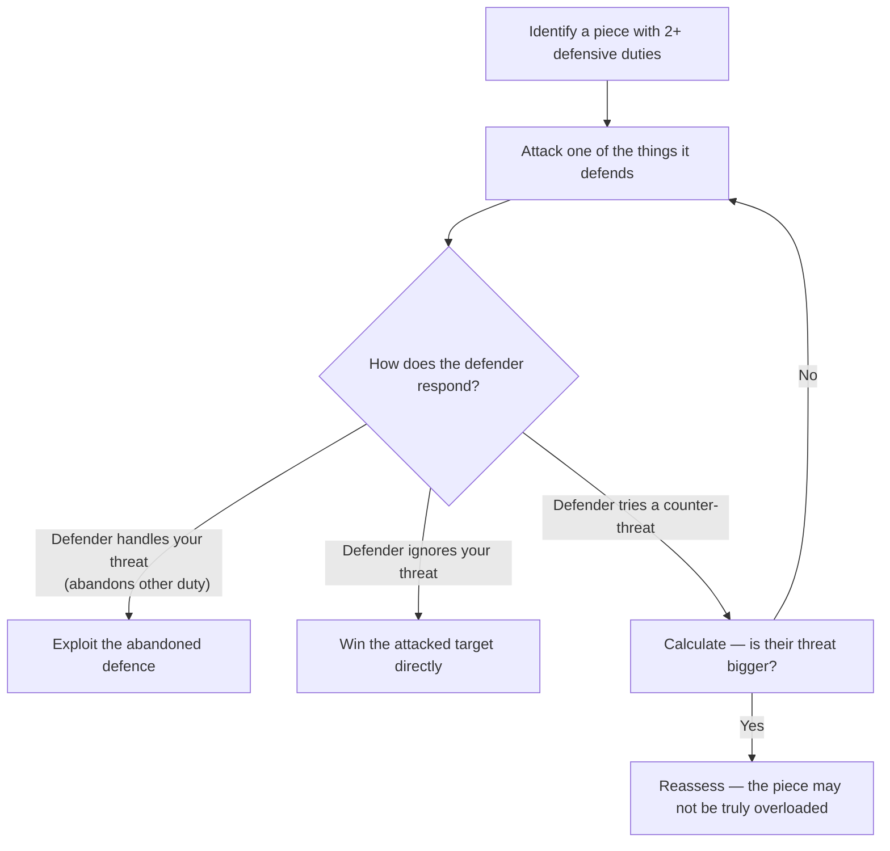

# Overloaded Pieces

A piece is **overloaded** (or **overworked**) when it has too many defensive responsibilities. It can't protect everything at once — exploit this by attacking one of its duties, forcing it to abandon another.

**See also:** [Deflection & Decoy](deflection-decoy.md) | [Removing the Defender](removing-the-defender.md) | [Back Rank Tactics](back-rank.md)

---

## How It Works



1. Identify a piece that is performing **two or more** defensive duties simultaneously
2. Attack one of the things it's defending
3. When it responds to your threat, the other duty is abandoned
4. Exploit the abandoned defence

---

## Example

```
Black's Queen on d7 is defending:
  (a) the Rd8 (preventing Rxd8#)
  (b) the Bb5 (preventing Qxb5)

White plays Qxb5! — if Qxb5, then Rxd8# (back rank mate).
If Black doesn't recapture on b5, White is up a bishop.
The queen was overloaded — it couldn't do both jobs.
```

---

## Common Overloaded Pieces

1. **Queen defending back rank AND a piece:** Very common — the queen is often the last defender
2. **Knight defending two squares:** A knight on f6 might need to guard d7 and h7 simultaneously
3. **Rook defending a rank AND a file:** A rook can only control one direction at a time
4. **King as overloaded piece:** The king sometimes has to guard a pawn AND stay near the defence

---

## Spotting Overloaded Pieces

Ask yourself:
- "What is each of my opponent's pieces doing?"
- "Is any single piece responsible for multiple tasks?"
- "What happens if I attack one of those tasks — does the other collapse?"

---

## Practical Advice

- Overloaded pieces are often the hidden reason a combination works
- They connect directly to [deflection](deflection-decoy.md) — deflecting an overloaded piece wins because it can't maintain both duties
- In complex positions, catalogue each enemy piece's responsibilities — the overloaded one is your target

---

**Next:** [Removing the Defender](removing-the-defender.md) | **Back to:** [Tactics Index](index.md)
