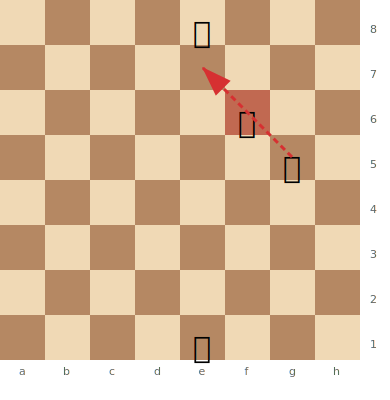
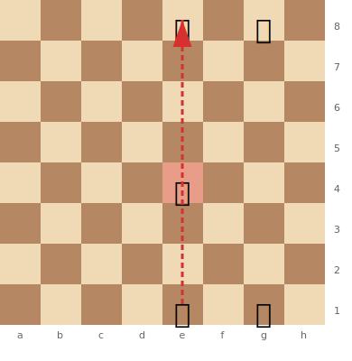
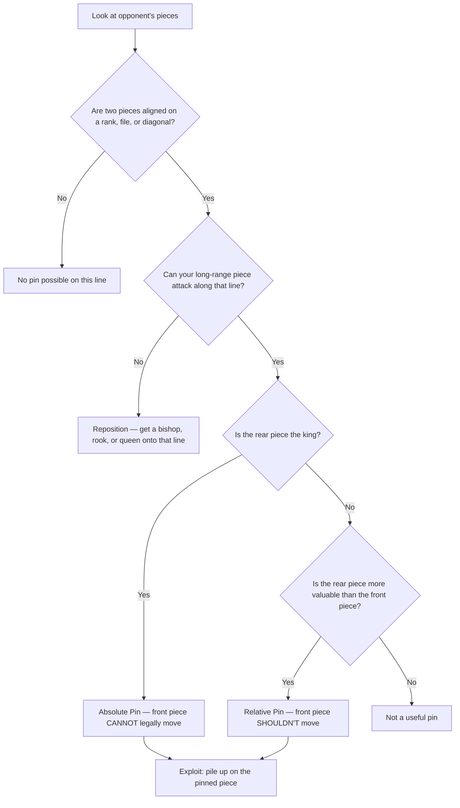
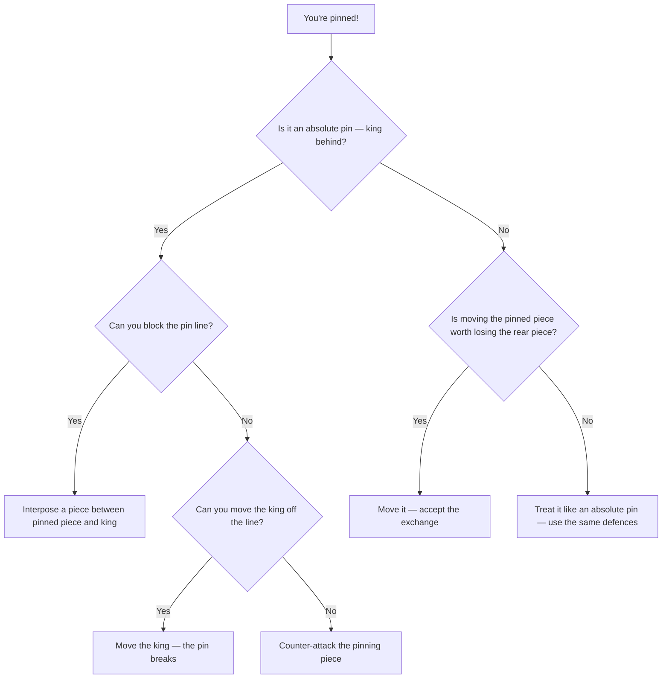

# Pins

A **pin** is a tactic where an attacking piece restricts an enemy piece from moving because doing so would expose a more valuable piece (or the king) behind it.

**See also:** [Skewers](skewers.md) | [Discovered Attacks](discovered-attacks.md) | [Fundamentals — Piece Values](../fundamentals/piece-values.md)

---

## Types of Pins

### Absolute Pin

The piece behind the pinned piece is the **king**. The pinned piece **cannot legally move** because it would leave the king in check.

**White's Bg5 pins the Nf6 against the king — the knight cannot legally move:**



> **FEN:** `4k3/8/5n2/6B1/8/8/8/4K3 w - - 0 1`

The Nf6 is pinned to the Ke8 — moving it would expose the king to the bishop. This is an absolute pin.

### Relative Pin

The piece behind the pinned piece is valuable but not the king. The pinned piece **can** legally move, but doing so would lose material.

**White's Re1 pins the Be4 against the queen — the bishop shouldn't move:**



> **FEN:** `4q1k1/8/8/8/4b3/8/8/4R1K1 w - - 0 1`

The Be4 can legally move, but if it does, Rxe8 wins the queen. This is a relative pin -- the bishop is pinned along the e-file against the more valuable queen.

---

## Identifying a Pin



## Exploiting Pins

1. **Pile up on the pinned piece:** Attack it with additional pieces. Since it can't move (or shouldn't), it becomes a target.
2. **Win material directly:** If the pinned piece is less valuable than what it shields, win it.
3. **Restrict the opponent:** Even if you can't win material immediately, a pin limits the opponent's options.

### Example: Piling Up

```
Position: White Bg5 pins Black's Nf6 against the Qd8.
White plays Nd5 — now the knight is attacked by two pieces (Bg5 and Nd5) and can't move due to the pin.
```

---

## Breaking Pins



1. **Block the pin:** Interpose a piece between the pinned piece and the piece behind it.
2. **Move the piece behind:** Remove the valuable piece from the line of the pin.
3. **Counter-attack the pinning piece:** Attack the piece doing the pinning.
4. **Advance with tempo:** Sometimes the pinned piece can advance with a threat, breaking the pin dynamically.

---

## Common Pin Patterns

- **Bishop pins on the knight:** Bg5 pinning Nf6 against the queen/king (extremely common after 1.e4 e5 2.Nf3 Nc6 3.Bb5)
- **Rook pins on a file or rank:** Rook on the same file as king and a piece in between
- **Queen pins:** The queen can pin along ranks, files, and diagonals

## Practical Advice

- Always check for pin possibilities on open files, ranks, and diagonals
- When you see a piece lined up with a more valuable piece, look for a pin
- Pins are often the first step in longer combinations — a pinned piece is a weakness

---

**Next:** [Forks](forks.md) | **Back to:** [Tactics Index](index.md)
