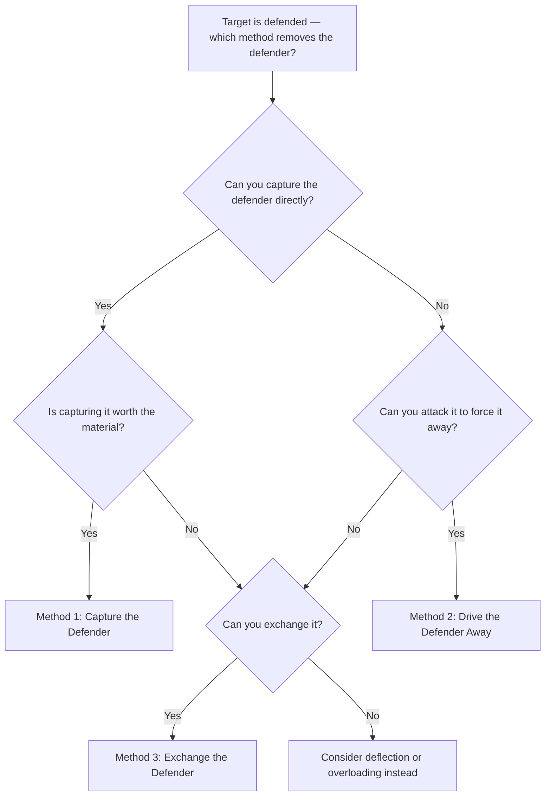

# Removing the Defender

**Removing the defender** (also called **undermining** or **removal of the guard**) eliminates the piece that is protecting a key square or another piece. Once the defender is gone, the position collapses.

**See also:** [Overloaded Pieces](overloaded-pieces.md) | [Deflection & Decoy](deflection-decoy.md) | [Famous Games — The Opera Game](../famous-games/opera-game.md)

---

## Choosing Your Method



## Three Methods

### 1. Capture the Defender

The most direct approach — simply take the piece that's defending.

<svg viewBox="0 0 390 400" xmlns="http://www.w3.org/2000/svg" style="max-width:400px">
  <rect x="0" y="0" width="360" height="360" fill="#b58863"/>
  <rect x="0" y="0" width="45" height="45" fill="#f0d9b5"/><rect x="90" y="0" width="45" height="45" fill="#f0d9b5"/><rect x="180" y="0" width="45" height="45" fill="#f0d9b5"/><rect x="270" y="0" width="45" height="45" fill="#f0d9b5"/>
  <rect x="45" y="45" width="45" height="45" fill="#f0d9b5"/><rect x="135" y="45" width="45" height="45" fill="#f0d9b5"/><rect x="225" y="45" width="45" height="45" fill="#f0d9b5"/><rect x="315" y="45" width="45" height="45" fill="#f0d9b5"/>
  <rect x="0" y="90" width="45" height="45" fill="#f0d9b5"/><rect x="90" y="90" width="45" height="45" fill="#f0d9b5"/><rect x="180" y="90" width="45" height="45" fill="#f0d9b5"/><rect x="270" y="90" width="45" height="45" fill="#f0d9b5"/>
  <rect x="45" y="135" width="45" height="45" fill="#f0d9b5"/><rect x="135" y="135" width="45" height="45" fill="#f0d9b5"/><rect x="225" y="135" width="45" height="45" fill="#f0d9b5"/><rect x="315" y="135" width="45" height="45" fill="#f0d9b5"/>
  <rect x="0" y="180" width="45" height="45" fill="#f0d9b5"/><rect x="90" y="180" width="45" height="45" fill="#f0d9b5"/><rect x="180" y="180" width="45" height="45" fill="#f0d9b5"/><rect x="270" y="180" width="45" height="45" fill="#f0d9b5"/>
  <rect x="45" y="225" width="45" height="45" fill="#f0d9b5"/><rect x="135" y="225" width="45" height="45" fill="#f0d9b5"/><rect x="225" y="225" width="45" height="45" fill="#f0d9b5"/><rect x="315" y="225" width="45" height="45" fill="#f0d9b5"/>
  <rect x="0" y="270" width="45" height="45" fill="#f0d9b5"/><rect x="90" y="270" width="45" height="45" fill="#f0d9b5"/><rect x="180" y="270" width="45" height="45" fill="#f0d9b5"/><rect x="270" y="270" width="45" height="45" fill="#f0d9b5"/>
  <rect x="45" y="315" width="45" height="45" fill="#f0d9b5"/><rect x="135" y="315" width="45" height="45" fill="#f0d9b5"/><rect x="225" y="315" width="45" height="45" fill="#f0d9b5"/><rect x="315" y="315" width="45" height="45" fill="#f0d9b5"/>
  <rect x="225" y="90" width="45" height="45" fill="#d63031" opacity="0.35"/>
  <rect x="315" y="45" width="45" height="45" fill="#d63031" opacity="0.35"/>
  <defs><marker id="ah" markerWidth="10" markerHeight="7" refX="10" refY="3.5" orient="auto"><polygon points="0 0,10 3.5,0 7" fill="#d63031"/></marker></defs>
  <text x="247" y="33" font-size="30" text-anchor="middle" dominant-baseline="central" font-family="serif">♜</text>
  <text x="292" y="33" font-size="30" text-anchor="middle" dominant-baseline="central" font-family="serif">♚</text>
  <text x="247" y="78" font-size="30" text-anchor="middle" dominant-baseline="central" font-family="serif">♟</text>
  <text x="292" y="78" font-size="30" text-anchor="middle" dominant-baseline="central" font-family="serif">♟</text>
  <text x="337" y="78" font-size="30" text-anchor="middle" dominant-baseline="central" font-family="serif">♟</text>
  <text x="247" y="123" font-size="30" text-anchor="middle" dominant-baseline="central" font-family="serif">♞</text>
  <text x="292" y="168" font-size="30" text-anchor="middle" dominant-baseline="central" font-family="serif">♗</text>
  <text x="337" y="303" font-size="30" text-anchor="middle" dominant-baseline="central" font-family="serif">♕</text>
  <text x="292" y="348" font-size="30" text-anchor="middle" dominant-baseline="central" font-family="serif">♔</text>
  <line x1="292" y1="157" x2="247" y2="112" stroke="#d63031" stroke-width="3" marker-end="url(#ah)"/>
  <line x1="337" y1="292" x2="337" y2="67" stroke="#d63031" stroke-width="3" marker-end="url(#ah)" stroke-dasharray="6,4"/>
  <text x="22" y="375" font-size="11" fill="#666" text-anchor="middle" font-family="sans-serif">a</text>
  <text x="67" y="375" font-size="11" fill="#666" text-anchor="middle" font-family="sans-serif">b</text>
  <text x="112" y="375" font-size="11" fill="#666" text-anchor="middle" font-family="sans-serif">c</text>
  <text x="157" y="375" font-size="11" fill="#666" text-anchor="middle" font-family="sans-serif">d</text>
  <text x="202" y="375" font-size="11" fill="#666" text-anchor="middle" font-family="sans-serif">e</text>
  <text x="247" y="375" font-size="11" fill="#666" text-anchor="middle" font-family="sans-serif">f</text>
  <text x="292" y="375" font-size="11" fill="#666" text-anchor="middle" font-family="sans-serif">g</text>
  <text x="337" y="375" font-size="11" fill="#666" text-anchor="middle" font-family="sans-serif">h</text>
  <text x="370" y="33" font-size="11" fill="#666" font-family="sans-serif">8</text>
  <text x="370" y="78" font-size="11" fill="#666" font-family="sans-serif">7</text>
  <text x="370" y="123" font-size="11" fill="#666" font-family="sans-serif">6</text>
  <text x="370" y="168" font-size="11" fill="#666" font-family="sans-serif">5</text>
  <text x="370" y="213" font-size="11" fill="#666" font-family="sans-serif">4</text>
  <text x="370" y="258" font-size="11" fill="#666" font-family="sans-serif">3</text>
  <text x="370" y="303" font-size="11" fill="#666" font-family="sans-serif">2</text>
  <text x="370" y="348" font-size="11" fill="#666" font-family="sans-serif">1</text>
</svg>

> **FEN:** `5rk1/5ppp/5n2/6B1/8/8/7Q/6K1 w - - 0 1`

### 2. Drive the Defender Away

Force the defending piece to move by attacking it.

```
Black's Bf6 defends the d4 knight. White plays g5, chasing the bishop away.
Now the knight on d4 is undefended and can be captured.
```

### 3. Exchange the Defender

Trade off the defending piece, even if it means exchanging an active piece.

```
Black's Nc6 defends the e5 pawn. White plays Bxc6 bxc6, removing the defender.
Now Nxe5 wins the pawn.
```

---

## Classic Example: The Opera Game

In [Morphy vs Duke of Brunswick, 1858](../famous-games/opera-game.md), Morphy systematically removed the defenders of Black's position:

1. Exchanged off pieces that defended key squares
2. Sacrificed the queen to deflect the last defender
3. Delivered checkmate on the back rank

---

## Practical Advice

- Before launching an attack, identify what defends the target. Can you remove it?
- Removing the defender often requires a sacrifice — the material invested is recovered by the collapse of the defence
- This tactic frequently combines with [back rank tactics](back-rank.md) and [mating patterns](mating-patterns.md)

---

**Next:** [Interference](interference.md) | **Back to:** [Tactics Index](index.md)
