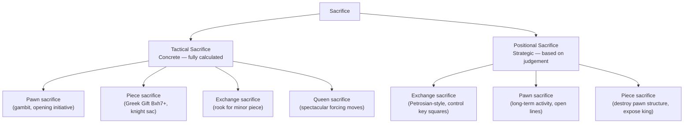
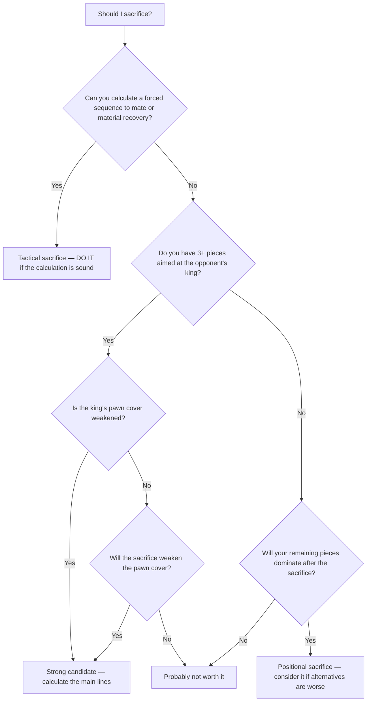

# Sacrifices

A **sacrifice** is the voluntary giving up of material for compensation — whether checkmate, a decisive attack, superior piece activity, or positional advantage.

**See also:** [Mating Patterns](mating-patterns.md) | [Attacking the Castled King](../middlegame/attacking-the-king.md) | [Fundamentals — Piece Values](../fundamentals/piece-values.md)

---

## Types of Sacrifice

### Tactical Sacrifice (Concrete)

Material is given up for a **forced** sequence leading to checkmate or material recovery with interest. These are calculated completely.

```
Example: Bxh7+ Kxh7, Ng5+ Kg8, Qh5 — forced mate or winning back material.
This is the Greek Gift sacrifice — see below.
```

### Positional Sacrifice (Strategic)

Material is given up for **long-term** compensation: activity, initiative, weak squares, attack. Not fully calculated — based on judgement.

```
Example: The exchange sacrifice in the Sicilian Dragon (Rxc3) —
Black gives a rook for a knight, destroying White's pawn structure and gaining dark-square control.
```

---

## The Greek Gift Sacrifice (Bxh7+)

The most famous attacking sacrifice in chess. White sacrifices a bishop on h7 to expose the castled king.

### Classical Pattern

**White to play: Bxh7+! -- the Greek Gift sacrifice:**

<svg viewBox="0 0 390 400" xmlns="http://www.w3.org/2000/svg" style="max-width:400px">
  <rect x="0" y="0" width="360" height="360" fill="#b58863"/>
  <rect x="0" y="0" width="45" height="45" fill="#f0d9b5"/><rect x="90" y="0" width="45" height="45" fill="#f0d9b5"/><rect x="180" y="0" width="45" height="45" fill="#f0d9b5"/><rect x="270" y="0" width="45" height="45" fill="#f0d9b5"/>
  <rect x="45" y="45" width="45" height="45" fill="#f0d9b5"/><rect x="135" y="45" width="45" height="45" fill="#f0d9b5"/><rect x="225" y="45" width="45" height="45" fill="#f0d9b5"/><rect x="315" y="45" width="45" height="45" fill="#f0d9b5"/>
  <rect x="0" y="90" width="45" height="45" fill="#f0d9b5"/><rect x="90" y="90" width="45" height="45" fill="#f0d9b5"/><rect x="180" y="90" width="45" height="45" fill="#f0d9b5"/><rect x="270" y="90" width="45" height="45" fill="#f0d9b5"/>
  <rect x="45" y="135" width="45" height="45" fill="#f0d9b5"/><rect x="135" y="135" width="45" height="45" fill="#f0d9b5"/><rect x="225" y="135" width="45" height="45" fill="#f0d9b5"/><rect x="315" y="135" width="45" height="45" fill="#f0d9b5"/>
  <rect x="0" y="180" width="45" height="45" fill="#f0d9b5"/><rect x="90" y="180" width="45" height="45" fill="#f0d9b5"/><rect x="180" y="180" width="45" height="45" fill="#f0d9b5"/><rect x="270" y="180" width="45" height="45" fill="#f0d9b5"/>
  <rect x="45" y="225" width="45" height="45" fill="#f0d9b5"/><rect x="135" y="225" width="45" height="45" fill="#f0d9b5"/><rect x="225" y="225" width="45" height="45" fill="#f0d9b5"/><rect x="315" y="225" width="45" height="45" fill="#f0d9b5"/>
  <rect x="0" y="270" width="45" height="45" fill="#f0d9b5"/><rect x="90" y="270" width="45" height="45" fill="#f0d9b5"/><rect x="180" y="270" width="45" height="45" fill="#f0d9b5"/><rect x="270" y="270" width="45" height="45" fill="#f0d9b5"/>
  <rect x="45" y="315" width="45" height="45" fill="#f0d9b5"/><rect x="135" y="315" width="45" height="45" fill="#f0d9b5"/><rect x="225" y="315" width="45" height="45" fill="#f0d9b5"/><rect x="315" y="315" width="45" height="45" fill="#f0d9b5"/>
  <rect x="315" y="45" width="45" height="45" fill="#d63031" opacity="0.35"/>
  <defs><marker id="ah" markerWidth="10" markerHeight="7" refX="10" refY="3.5" orient="auto"><polygon points="0 0,10 3.5,0 7" fill="#d63031"/></marker></defs>
  <text x="157" y="33" font-size="30" text-anchor="middle" dominant-baseline="central" font-family="serif">♛</text>
  <text x="247" y="33" font-size="30" text-anchor="middle" dominant-baseline="central" font-family="serif">♜</text>
  <text x="292" y="33" font-size="30" text-anchor="middle" dominant-baseline="central" font-family="serif">♚</text>
  <text x="22" y="78" font-size="30" text-anchor="middle" dominant-baseline="central" font-family="serif">♟</text>
  <text x="67" y="78" font-size="30" text-anchor="middle" dominant-baseline="central" font-family="serif">♟</text>
  <text x="247" y="78" font-size="30" text-anchor="middle" dominant-baseline="central" font-family="serif">♟</text>
  <text x="292" y="78" font-size="30" text-anchor="middle" dominant-baseline="central" font-family="serif">♟</text>
  <text x="337" y="78" font-size="30" text-anchor="middle" dominant-baseline="central" font-family="serif">♟</text>
  <text x="157" y="258" font-size="30" text-anchor="middle" dominant-baseline="central" font-family="serif">♗</text>
  <text x="247" y="258" font-size="30" text-anchor="middle" dominant-baseline="central" font-family="serif">♘</text>
  <text x="22" y="303" font-size="30" text-anchor="middle" dominant-baseline="central" font-family="serif">♙</text>
  <text x="67" y="303" font-size="30" text-anchor="middle" dominant-baseline="central" font-family="serif">♙</text>
  <text x="112" y="303" font-size="30" text-anchor="middle" dominant-baseline="central" font-family="serif">♙</text>
  <text x="247" y="303" font-size="30" text-anchor="middle" dominant-baseline="central" font-family="serif">♙</text>
  <text x="292" y="303" font-size="30" text-anchor="middle" dominant-baseline="central" font-family="serif">♙</text>
  <text x="337" y="303" font-size="30" text-anchor="middle" dominant-baseline="central" font-family="serif">♙</text>
  <text x="22" y="348" font-size="30" text-anchor="middle" dominant-baseline="central" font-family="serif">♖</text>
  <text x="157" y="348" font-size="30" text-anchor="middle" dominant-baseline="central" font-family="serif">♕</text>
  <text x="292" y="348" font-size="30" text-anchor="middle" dominant-baseline="central" font-family="serif">♔</text>
  <line x1="157" y1="247" x2="337" y2="67" stroke="#d63031" stroke-width="3" marker-end="url(#ah)"/>
  <text x="22" y="375" font-size="11" fill="#666" text-anchor="middle" font-family="sans-serif">a</text>
  <text x="67" y="375" font-size="11" fill="#666" text-anchor="middle" font-family="sans-serif">b</text>
  <text x="112" y="375" font-size="11" fill="#666" text-anchor="middle" font-family="sans-serif">c</text>
  <text x="157" y="375" font-size="11" fill="#666" text-anchor="middle" font-family="sans-serif">d</text>
  <text x="202" y="375" font-size="11" fill="#666" text-anchor="middle" font-family="sans-serif">e</text>
  <text x="247" y="375" font-size="11" fill="#666" text-anchor="middle" font-family="sans-serif">f</text>
  <text x="292" y="375" font-size="11" fill="#666" text-anchor="middle" font-family="sans-serif">g</text>
  <text x="337" y="375" font-size="11" fill="#666" text-anchor="middle" font-family="sans-serif">h</text>
  <text x="370" y="33" font-size="11" fill="#666" font-family="sans-serif">8</text>
  <text x="370" y="78" font-size="11" fill="#666" font-family="sans-serif">7</text>
  <text x="370" y="123" font-size="11" fill="#666" font-family="sans-serif">6</text>
  <text x="370" y="168" font-size="11" fill="#666" font-family="sans-serif">5</text>
  <text x="370" y="213" font-size="11" fill="#666" font-family="sans-serif">4</text>
  <text x="370" y="258" font-size="11" fill="#666" font-family="sans-serif">3</text>
  <text x="370" y="303" font-size="11" fill="#666" font-family="sans-serif">2</text>
  <text x="370" y="348" font-size="11" fill="#666" font-family="sans-serif">1</text>
</svg>

> **FEN:** `3q1rk1/pp3ppp/8/8/8/3B1N2/PPP2PPP/R2Q2K1 w - - 0 1`

1.Bxh7+! Kxh7 2.Ng5+ (the knight leaps in with check, threatening Qh5+). The attack is typically decisive.

### After 2...Kg8

```
3.Qh5 — threatening Qxf7# and Qh7#. The attack is usually decisive.
```

### After 2...Kg6

```
3.Qd3+! (or Qg4+) f5 4.Qg3 — the king is in the open and under fierce attack.
```

### Requirements for the Greek Gift

1. Bishop can reach h7 (usually from d3 or c2)
2. Knight can reach g5 after Bxh7+ Kxh7 Ng5+
3. The queen can join the attack quickly (Qh5 or Qd3)
4. Black's Nf6 is absent (the knight on f6 defends h7 and blocks Qh5)

---

## Classic Bishop Sacrifices

### Bxh7+ (Greek Gift) — see above

### Bxg7
Sacrificing on g7 to destroy the kingside pawn cover. Often followed by Qg4+ or Ng5.

### Bxf7+
Classic in the [Italian Game](../openings/open-games/italian-game.md) — sacrifice on f7 to expose the king before castling.

---

## Exchange Sacrifices

Giving up a rook for a minor piece (bishop or knight). Common in:
- **[Sicilian Dragon](../openings/semi-open/sicilian-defense.md):** ...Rxc3 to destroy White's centre
- **[King's Indian](../openings/indian-defenses/kings-indian.md):** ...Rxf3 to open lines for the attack
- **Petrosian-style:** Positional exchange sacrifices to control key squares

---

## Queen Sacrifices

The most spectacular sacrifices. A queen sacrifice is usually the culmination of a deep combination. Famous examples:
- [The Opera Game](../famous-games/opera-game.md): Qb8+! for back rank mate
- [Game of the Century](../famous-games/game-of-century.md): Be6!! (setting up the queen sacrifice)
- [The Evergreen Game](../famous-games/evergreen-game.md): Qxd7+!!

---

## Sacrifice Classification



## When to Sacrifice



1. **When you can calculate the outcome:** Tactical sacrifices require concrete calculation
2. **When you have enough attackers:** Generally 3+ pieces should participate in an attack
3. **When the opponent's king is weakened:** Missing pawns, lack of defenders
4. **When your pieces are more active:** Positional sacrifices work when your remaining pieces dominate
5. **When the alternative is worse:** Sometimes sacrifice is the only way to maintain the initiative

---

**Next:** [Mating Patterns](mating-patterns.md) | **Back to:** [Tactics Index](index.md)
