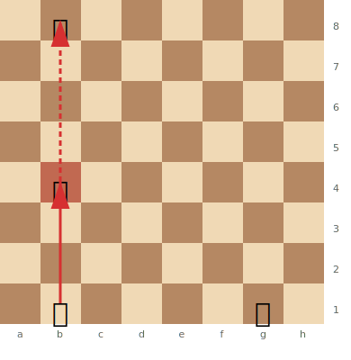

# Skewers

A **skewer** is the reverse of a [pin](pins.md). A piece attacks a valuable enemy piece, and when that piece moves, a less valuable piece behind it is captured.

**See also:** [Pins](pins.md) | [Discovered Attacks](discovered-attacks.md)

---

## How Skewers Work

1. A long-range piece (bishop, rook, or queen) attacks a valuable piece
2. The valuable piece must move (especially if it's the king in check)
3. The piece behind it is captured

---

## Types of Skewers

### Absolute Skewer (Through the King)

The most common type. The king is checked and must move, exposing a piece behind it.



> **FEN:** `1q6/8/8/8/1k6/8/8/1R4K1 w - - 0 1`

### Relative Skewer

The front piece is more valuable than the rear piece but is not the king. The front piece "should" move, allowing capture of the rear piece.

```
Example: White Bg2, Black Qd5, Black Ra8.
Bg2 attacks the queen through to the rook. The queen moves, and Bxa8 wins the rook.
```

---

## Skewer vs Pin

| Feature | Pin | Skewer |
|---------|-----|--------|
| More valuable piece | Behind (shielded) | In front (attacked) |
| Less valuable piece | In front (can't/shouldn't move) | Behind (captured after front moves) |
| Effect | Restricts the front piece | Wins the rear piece |

---

## Common Skewer Patterns

- **Back rank skewer:** Rook or queen checks the king along the back rank, winning a piece behind it
- **Diagonal skewer:** Bishop attacks king and piece on the same diagonal
- **Queen skewer:** The queen's versatility makes it the best skewering piece

## Practical Advice

- Look for skewers whenever the king and another piece are aligned on a rank, file, or diagonal
- After your opponent's king moves, check if any pieces are left on the vacated line
- Skewers are especially common in [endgames](../endgames/index.md) where pieces are more exposed

---

**Next:** [Discovered Attacks](discovered-attacks.md) | **Back to:** [Tactics Index](index.md)
