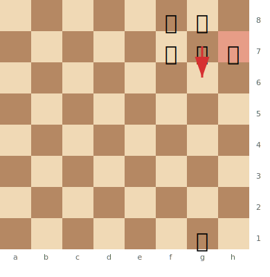

# Trapped Pieces

A **trapped piece** is one that has no safe squares to retreat to. Even though it's not immediately captured, it will be won because it can't escape.

**See also:** [Pins](pins.md) | [Forks](forks.md) | [Fundamentals — Piece Activity](../middlegame/piece-activity.md)

---

## Common Trapped Piece Patterns

### Noah's Ark Trap (Ruy Lopez)

```
1.e4 e5 2.Nf3 Nc6 3.Bb5 a6 4.Ba4 d6 5.d4 b5 6.Bb3 Nxd4 7.Nxd4 exd4 8.Qxd4? c5!
```

The queen retreats, and then ...c4 traps the Bb3. One of the oldest known traps — the "Noah's Ark" trap, supposedly old enough to have been known on the Ark.

### Trapped Bishop on h7/b7

**Black to play: g6 traps White's bishop on h7 — it has no escape:**



> **FEN:** `5rk1/5ppB/8/8/8/8/8/6K1 w - - 0 1`

After ...g6, the bishop on h7 is completely trapped. It has no safe square to retreat to (g8 is the king, g6 now has a pawn) and will be captured by ...Kg7 followed by ...Kxh7.

### Trapped Knight on the Rim

```
"A knight on the rim is dim." — Knights on edge squares (a, h files) have fewer escape squares and can easily be trapped by pawns.
```

### Trapped Rook in the Corner

```
In the opening, if a king hasn't castled and blocks a rook in the corner,
an opponent can sometimes prevent castling and win the rook.
```

---

## How to Trap Pieces

1. **Control escape squares** with pawns and pieces
2. **Advance pawns** to restrict a piece's movement — bishops and knights are especially vulnerable
3. **Use the edge of the board** — pieces near the edge have fewer options
4. **Lure pieces forward** into territory where they can be surrounded

## How to Avoid Being Trapped

1. **Always check retreat squares** before advancing a piece deep into enemy territory
2. **Knights on the rim are vulnerable** — keep them near the centre
3. **Bishops entering pawn chains** can be blocked in
4. **Don't be greedy** — grabbing a pawn deep in enemy territory often leads to a trapped piece

---

## The Desperado

When a piece is trapped and will be lost anyway, it should try to **sell its life dearly** — capture the most valuable piece it can before being taken. This is called a **desperado**.

```
Example: White's knight is trapped and will be captured next move.
Instead of waiting, the knight captures a rook first, then gets taken.
Net result: much better than simply losing the knight.
```

See also: [Zwischenzug](zwischenzug.md) — desperado moves are often intermediate moves.

---

**Next:** [Sacrifices](sacrifices.md) | **Back to:** [Tactics Index](index.md)
