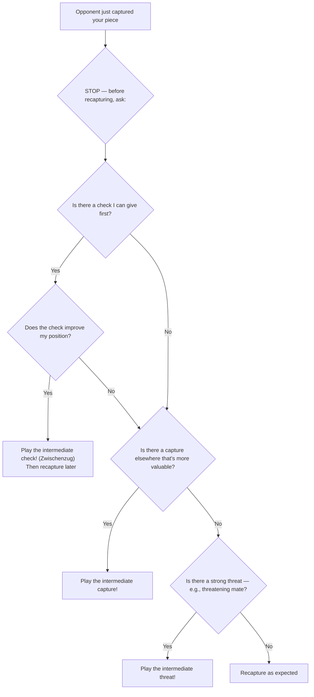

# Zwischenzug (Intermediate Move)

A **zwischenzug** (German: "in-between move") is an unexpected move inserted in the middle of an apparently forced sequence. Instead of making the "expected" recapture or response, you play a stronger move first — often a check, capture, or threat.

**See also:** [Discovered Attacks](discovered-attacks.md) | [Forks](forks.md) | [Fundamentals — Calculation](../fundamentals/how-to-study.md)

---

## Decision Flowchart

Before making the "obvious" recapture, run through this check:



## How It Works

```
Typical scenario:
1. White captures Black's bishop on d5 (Bxd5).
2. Black is "expected" to recapture (exd5 or cxd5).
3. Instead, Black plays Qh4+! — an intermediate check.
4. After White deals with the check, Black recaptures on d5 under better circumstances.
```

The zwischenzug changes the dynamic of the position — you get something extra (a check, an attack, a better recapture) before completing the expected sequence.

---

## Types of Zwischenzug

### Intermediate Check
The most common type. A check inserted before a recapture.

### Intermediate Capture
Capturing a different piece first, before making the expected recapture.

### Intermediate Threat
Creating a threat (e.g., threatening mate) that must be addressed before the expected continuation.

---

## Example

```
White plays Nxe5. Black is "supposed" to play dxe5.
Instead: Black plays Bxf2+! (zwischenzug — intermediate check).
White: Kxf2.
Now Black plays dxe5, and White's king is exposed on f2 as a bonus.
```

---

## Defending Against Zwischenzugs

1. **Always calculate one move deeper** — don't assume the opponent will make the "obvious" recapture
2. **Ask: "What else can they do?"** before assuming a forcing sequence
3. **Check for checks:** The most dangerous zwischenzugs are intermediate checks
4. **Avoid leaving pieces en prise** in a position where the opponent has forcing moves

---

## Practical Advice

- Zwischenzugs are one of the main reasons calculations go wrong — you expect a recapture, they play something else
- Both offensive and defensive: you can play a zwischenzug, and you must watch for your opponent's
- In exchanges, **always** check if there's something better than the automatic recapture
- "What is the most annoying thing I can do right now before recapturing?"

---

**Next:** [Back Rank Tactics](back-rank.md) | **Back to:** [Tactics Index](index.md)
