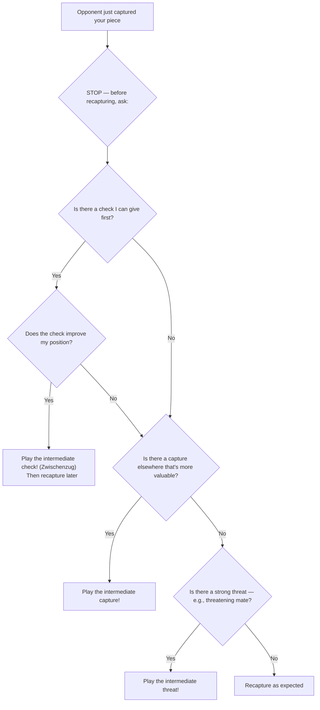

# Zwischenzug (Intermediate Move)

A **zwischenzug** (German: "in-between move") is an unexpected move inserted in the middle of an apparently forced sequence. Instead of making the "expected" recapture or response, you play a stronger move first — often a check, capture, or threat.

**See also:** [Discovered Attacks](discovered-attacks.md) | [Forks](forks.md) | [Fundamentals — Calculation](../fundamentals/how-to-study.md)

---

## Decision Flowchart

Before making the "obvious" recapture, run through this check:



## How It Works

```
Typical scenario:
1. White captures Black's bishop on d5 (Bxd5).
2. Black is "expected" to recapture (exd5 or cxd5).
3. Instead, Black plays Qh4+! — an intermediate check.
4. After White deals with the check, Black recaptures on d5 under better circumstances.
```

The zwischenzug changes the dynamic of the position — you get something extra (a check, an attack, a better recapture) before completing the expected sequence.

---

## Types of Zwischenzug

### Intermediate Check
The most common type. A check inserted before a recapture.

### Intermediate Capture
Capturing a different piece first, before making the expected recapture.

### Intermediate Threat
Creating a threat (e.g., threatening mate) that must be addressed before the expected continuation.

---

## Example

<svg viewBox="0 0 390 400" xmlns="http://www.w3.org/2000/svg" style="max-width:400px">
  <rect x="0" y="0" width="360" height="360" fill="#b58863"/>
  <rect x="0" y="0" width="45" height="45" fill="#f0d9b5"/><rect x="90" y="0" width="45" height="45" fill="#f0d9b5"/><rect x="180" y="0" width="45" height="45" fill="#f0d9b5"/><rect x="270" y="0" width="45" height="45" fill="#f0d9b5"/>
  <rect x="45" y="45" width="45" height="45" fill="#f0d9b5"/><rect x="135" y="45" width="45" height="45" fill="#f0d9b5"/><rect x="225" y="45" width="45" height="45" fill="#f0d9b5"/><rect x="315" y="45" width="45" height="45" fill="#f0d9b5"/>
  <rect x="0" y="90" width="45" height="45" fill="#f0d9b5"/><rect x="90" y="90" width="45" height="45" fill="#f0d9b5"/><rect x="180" y="90" width="45" height="45" fill="#f0d9b5"/><rect x="270" y="90" width="45" height="45" fill="#f0d9b5"/>
  <rect x="45" y="135" width="45" height="45" fill="#f0d9b5"/><rect x="135" y="135" width="45" height="45" fill="#f0d9b5"/><rect x="225" y="135" width="45" height="45" fill="#f0d9b5"/><rect x="315" y="135" width="45" height="45" fill="#f0d9b5"/>
  <rect x="0" y="180" width="45" height="45" fill="#f0d9b5"/><rect x="90" y="180" width="45" height="45" fill="#f0d9b5"/><rect x="180" y="180" width="45" height="45" fill="#f0d9b5"/><rect x="270" y="180" width="45" height="45" fill="#f0d9b5"/>
  <rect x="45" y="225" width="45" height="45" fill="#f0d9b5"/><rect x="135" y="225" width="45" height="45" fill="#f0d9b5"/><rect x="225" y="225" width="45" height="45" fill="#f0d9b5"/><rect x="315" y="225" width="45" height="45" fill="#f0d9b5"/>
  <rect x="0" y="270" width="45" height="45" fill="#f0d9b5"/><rect x="90" y="270" width="45" height="45" fill="#f0d9b5"/><rect x="180" y="270" width="45" height="45" fill="#f0d9b5"/><rect x="270" y="270" width="45" height="45" fill="#f0d9b5"/>
  <rect x="45" y="315" width="45" height="45" fill="#f0d9b5"/><rect x="135" y="315" width="45" height="45" fill="#f0d9b5"/><rect x="225" y="315" width="45" height="45" fill="#f0d9b5"/><rect x="315" y="315" width="45" height="45" fill="#f0d9b5"/>
  <rect x="225" y="270" width="45" height="45" fill="#d63031" opacity="0.35"/>
  <defs><marker id="ah" markerWidth="10" markerHeight="7" refX="10" refY="3.5" orient="auto"><polygon points="0 0,10 3.5,0 7" fill="#d63031"/></marker></defs>
  <text x="22" y="33" font-size="30" text-anchor="middle" dominant-baseline="central" font-family="serif">♜</text>
  <text x="157" y="33" font-size="30" text-anchor="middle" dominant-baseline="central" font-family="serif">♛</text>
  <text x="202" y="33" font-size="30" text-anchor="middle" dominant-baseline="central" font-family="serif">♚</text>
  <text x="337" y="33" font-size="30" text-anchor="middle" dominant-baseline="central" font-family="serif">♜</text>
  <text x="22" y="78" font-size="30" text-anchor="middle" dominant-baseline="central" font-family="serif">♟</text>
  <text x="67" y="78" font-size="30" text-anchor="middle" dominant-baseline="central" font-family="serif">♟</text>
  <text x="112" y="78" font-size="30" text-anchor="middle" dominant-baseline="central" font-family="serif">♟</text>
  <text x="247" y="78" font-size="30" text-anchor="middle" dominant-baseline="central" font-family="serif">♟</text>
  <text x="292" y="78" font-size="30" text-anchor="middle" dominant-baseline="central" font-family="serif">♟</text>
  <text x="337" y="78" font-size="30" text-anchor="middle" dominant-baseline="central" font-family="serif">♟</text>
  <text x="157" y="123" font-size="30" text-anchor="middle" dominant-baseline="central" font-family="serif">♟</text>
  <text x="112" y="168" font-size="30" text-anchor="middle" dominant-baseline="central" font-family="serif">♝</text>
  <text x="202" y="168" font-size="30" text-anchor="middle" dominant-baseline="central" font-family="serif">♘</text>
  <text x="22" y="303" font-size="30" text-anchor="middle" dominant-baseline="central" font-family="serif">♙</text>
  <text x="67" y="303" font-size="30" text-anchor="middle" dominant-baseline="central" font-family="serif">♙</text>
  <text x="112" y="303" font-size="30" text-anchor="middle" dominant-baseline="central" font-family="serif">♙</text>
  <text x="157" y="303" font-size="30" text-anchor="middle" dominant-baseline="central" font-family="serif">♙</text>
  <text x="247" y="303" font-size="30" text-anchor="middle" dominant-baseline="central" font-family="serif">♙</text>
  <text x="292" y="303" font-size="30" text-anchor="middle" dominant-baseline="central" font-family="serif">♙</text>
  <text x="337" y="303" font-size="30" text-anchor="middle" dominant-baseline="central" font-family="serif">♙</text>
  <text x="22" y="348" font-size="30" text-anchor="middle" dominant-baseline="central" font-family="serif">♖</text>
  <text x="112" y="348" font-size="30" text-anchor="middle" dominant-baseline="central" font-family="serif">♗</text>
  <text x="157" y="348" font-size="30" text-anchor="middle" dominant-baseline="central" font-family="serif">♕</text>
  <text x="202" y="348" font-size="30" text-anchor="middle" dominant-baseline="central" font-family="serif">♔</text>
  <text x="247" y="348" font-size="30" text-anchor="middle" dominant-baseline="central" font-family="serif">♗</text>
  <text x="337" y="348" font-size="30" text-anchor="middle" dominant-baseline="central" font-family="serif">♖</text>
  <line x1="112" y1="157" x2="247" y2="292" stroke="#d63031" stroke-width="3" marker-end="url(#ah)"/>
  <text x="22" y="375" font-size="11" fill="#666" text-anchor="middle" font-family="sans-serif">a</text>
  <text x="67" y="375" font-size="11" fill="#666" text-anchor="middle" font-family="sans-serif">b</text>
  <text x="112" y="375" font-size="11" fill="#666" text-anchor="middle" font-family="sans-serif">c</text>
  <text x="157" y="375" font-size="11" fill="#666" text-anchor="middle" font-family="sans-serif">d</text>
  <text x="202" y="375" font-size="11" fill="#666" text-anchor="middle" font-family="sans-serif">e</text>
  <text x="247" y="375" font-size="11" fill="#666" text-anchor="middle" font-family="sans-serif">f</text>
  <text x="292" y="375" font-size="11" fill="#666" text-anchor="middle" font-family="sans-serif">g</text>
  <text x="337" y="375" font-size="11" fill="#666" text-anchor="middle" font-family="sans-serif">h</text>
  <text x="370" y="33" font-size="11" fill="#666" font-family="sans-serif">8</text>
  <text x="370" y="78" font-size="11" fill="#666" font-family="sans-serif">7</text>
  <text x="370" y="123" font-size="11" fill="#666" font-family="sans-serif">6</text>
  <text x="370" y="168" font-size="11" fill="#666" font-family="sans-serif">5</text>
  <text x="370" y="213" font-size="11" fill="#666" font-family="sans-serif">4</text>
  <text x="370" y="258" font-size="11" fill="#666" font-family="sans-serif">3</text>
  <text x="370" y="303" font-size="11" fill="#666" font-family="sans-serif">2</text>
  <text x="370" y="348" font-size="11" fill="#666" font-family="sans-serif">1</text>
</svg>

> **FEN:** `r2qk2r/ppp2ppp/3p4/2b1N3/8/8/PPPP1PPP/R1BQKB1R w - - 0 1`

---

## Defending Against Zwischenzugs

1. **Always calculate one move deeper** — don't assume the opponent will make the "obvious" recapture
2. **Ask: "What else can they do?"** before assuming a forcing sequence
3. **Check for checks:** The most dangerous zwischenzugs are intermediate checks
4. **Avoid leaving pieces en prise** in a position where the opponent has forcing moves

---

## Practical Advice

- Zwischenzugs are one of the main reasons calculations go wrong — you expect a recapture, they play something else
- Both offensive and defensive: you can play a zwischenzug, and you must watch for your opponent's
- In exchanges, **always** check if there's something better than the automatic recapture
- "What is the most annoying thing I can do right now before recapturing?"

---

**Next:** [Back Rank Tactics](back-rank.md) | **Back to:** [Tactics Index](index.md)
